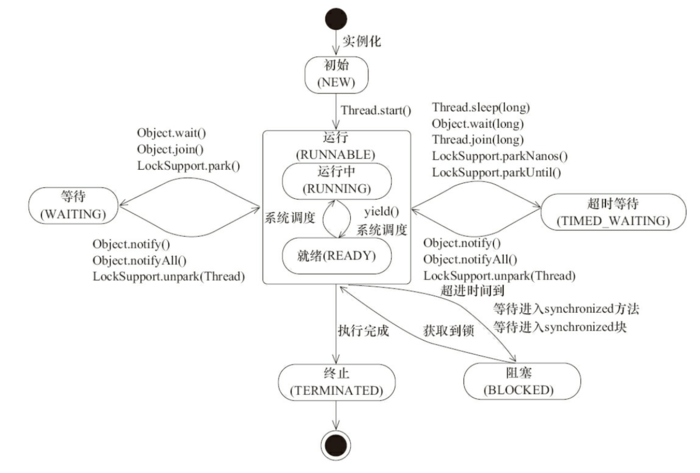

# 一、并发的发展历史

## 1. 真空管和穿孔打卡

操作员在机房里面来回调度资源，计算机同一时刻只能运行一个程序，在程序输入的过程中，计算机处于空闲状态。

## 2. 晶体管和批处理器

计算机通过读取磁带的指令来进行运算。

批处理操作系统虽然能够解决计算机的空闲问题，但是当某一个作业因为等待磁盘或者其他 I/O 操作而暂停时，CPU 就只能阻塞直到该 I/O 操作完成。

## 3. 集成电路和多道程序设计

把内存分为几个部分，每一个部分存放不同的程序。当一个程序需要等待 I/O 操作完成时，CPU 可以切换执行内存中的另外一个程序。

这时引入了「进程」的概念，进程的本质是一个正在执行的程序，程序运行时会创建一个进程，并且给每个进程分配独立的内存地址空间保证每个进程地址不会相互干扰。同时，在 CPU 对进程做时间片的切换时，保证进程切换过程中仍然要从进程之前运行的位置处开始执行，所以进程通常还会包括程序计数器、堆栈指针。

并发的实现时通过 CPU 时间片不断切换执行的。对于单核 CPU 来说，在任意一个时刻只会有一个进程被 CPU 调度。

## 4. 线程的出现

有了进程以后，为什么还会发明线程呢？

- 在多核 CPU 中，利用多线程可以实现真正意义上的并行执行。
- 在一个应用进程中，会存在多个同时执行的任务，如果其中一个任务被阻塞，将会引起不依赖该任务的任务也被阻塞。 通过对不同任务创建不同的线程去处理，可以提升程序处理的实时性。
- 线程可以认为是轻量级的进程，所以线程的创建、销毁比进程更快。

# 二、易混淆概念

## 1. 进程和线程

进程是操作系统分配资源的最小单元，线程是操作系统调度的最小单元。

一个程序下至少有一个进程，一个进程至少有一个线程，一个进程下也可以有多个线程来增加程序的执行速度。

## 2. 并行和并发

**并行：** 多个处理器或多核处理器同时处理多个任务。

**并发：**多个任务在同一个 CPU核上，按细分的时间片轮流执行，由于时间间隔较短，使人感觉两个任务都在运行。

# 三、初识线程

## 1. 什么是线程？

线程时操作系统的最小调度单元，在一个进程里可以创建多个线程，这些线程都拥有各自的计数器、堆栈和局部变量等属性，并且能够访问共享的内存变量。处理器在这些线程上高速切换，让使用者感觉到这些线程在同时执行。

## 2. 优缺点与使用场景

优点：提高 CPU 的使用率。

缺点：

设计复杂。多线程中共享堆内存和方法区，因此里面的一些数据是可以共享的，在设计时要确保数据的准确性。
资源消耗增多。栈内存是不共享的，如果启用多个线程的话会占用更多的内存。
使用场景：

通过并行计算提高程序执行性能。
需要等待网络、I/O 响应导致耗费大量的执行时间，可以采用异步线程的方式来减少阻塞。

## 3. 线程状态

Java 线程在运行的声明周期中可能有 6 种不同的状态。

<div align="center">   </div><br>

### Ⅰ. 初始状态 (NEW)

线程被创建，但是还没有调用 start 方法。

### Ⅱ. 运行状态 (RUNNABLE)

Java 线程将操作系统中的就绪和运行两种状态统一称为「运行中」。

### Ⅲ. 阻塞状态 (BLOCKED)

线程阻塞于锁。

- 等待阻塞：运行的线程执行 wait 方法，JVM 会把当前线程放入到等待队列。
- 同步阻塞：运行的线程在获取对象的同步锁时，若该同步锁被其它线程锁占用，那么 JVM 会把当前的线程放入到锁池中。
- 其它阻塞：运行的线程执行 Thread.sleep 或者 t.join 方法 ，或者发出 I/O 请求时，JVM 会把当前线程设置为阻塞状态，当 sleep 结束、join 线程终止、IO 处理完毕后线程恢复。

### Ⅳ. 等待状态 (WAITING)

当前线程需要等待其它线程做出一些特定的动作(通知或中断)。

### Ⅴ. 超时等待状态 (TIME_WAITING)

无需等待其它线程显式地唤醒，在一定时间之后会被系统自动唤醒。

### Ⅵ. 终止状态 (TERMINATED)

当前线程已经执行完毕。


# 四、启动与终止线程

## 1. 创建线程

Java 中有三种创建线程的方式。

### Ⅰ. 继承 Tread 类

Thread 类本质上是实现了 Runnable 接口的一个实例，代表一个线程实例。启动线程的唯一方法就是通过 Thread 类的 start() 实例方法，start() 方法是一个 native 方法，它会启动一个新线程，并执行 run() 方法。

```java
public class MyThread extends Thread{
    @Override
    public void run(){
        //...
    }
}

MyThread myThread1 = new MyThread();
MyThread myThread2 = new MyThread();
myThread1.start();
myThread2.start();
```

### Ⅱ. 实现 Runnable 接口

如果自己的类已经继承的其它的类，就无法直接继承 Thread，此时可以实现 Runnable 接口。

```java
public class MyThread implements Runnable{
    @Override
    public void run(){
        //...
    }
}

MyThread myThread1 = new MyThread();
MyThread myThread2 = new MyThread();
myThread1.start();
myThread2.start();
```

### Ⅲ. 实现 Callable 接口

该接口位于 `java.util.concurrent` 包下面，使用 Callable 接口创建的线程能够获得返回值并且可以声明异常。使用 Callable 可以拿到返回值，而 Runnable 没有返回值，Callable 可以看作是 Runnable 的补充。

```java
public class CallableDemo implements Callable<String>{
    public static void main(String[] args) throws ExecutionException, InterruptedException {
        // 创建 ExecutorService 线程池
        ExecutorService executorService = Executors.newFixedThreadPool(1);

        CallableDemo callableDemo = new CallableDemo();
        Future<String> future = executorService.submit(callableDemo);
        System.out.println(future.get());

        // 关闭线程池，不再接收新的线程，未执行完的线程不会被关闭
        executorService.shutdown();
    }
    @Override
    public String call() throws Exception {
        int a=1;
        int b=2;
        System.out.println(a+b);
        return "执行结果:"+(a+b);
    }
}
```

## 2. 启动线程

创建线程对象后，调用 start() 方法启动线程。

run() 方法用于执行线程的运行时代码。run() 可以重复调用，而 start() 只能调用一次。

start() 源码中会调用 os::start_thread(thread)，调用平台的启动线程方法，最终会调用 Thread.cpp 文件中的 JavaThread::run() 方法。

## 3. 中断

中断可以理解为线程的一个标识位属性，它表示一个运行中的线程是否被其它线程进行了中断操作。

不能调用 stop 方法，stop 方法在结束一个线程时不能保证线程资源的正常释放，可能会导致程序出现一些不确定的状态。

### Ⅰ. interrupt() / isInterrupted()

interrupt()：

中断该线程对象，如果该线程处于阻塞或等待状态，会抛出 InterruptedException 异常，从而提前结束该线程。

isInterrupted()：

测试该线程对象是否被中断，中断标志位不会被清除。

```java
private static int i;
public static void main(String[] args) throws InterruptedException {
    Thread thread = new Thread(() -> {
        // 默认为 false，通过 thread.interrupt() 后变成 true
        while(!Thread.currentThread().isInterrupted()){
            i++;
        }
        System.out.println("i:" + i);
    });
    thread.start();
    TimeUnit.SECONDS.sleep(1);
    thread.interrupt();
}
```

### Ⅲ. interrupted()

静态方法，测试当前线程是否被中断，中断标志位会被清除。