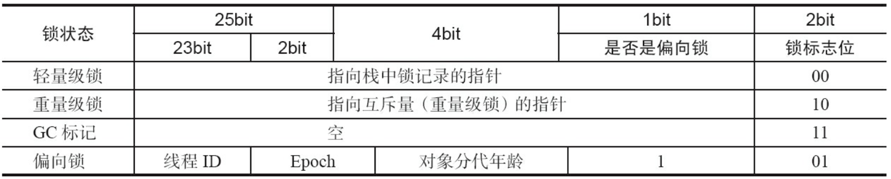
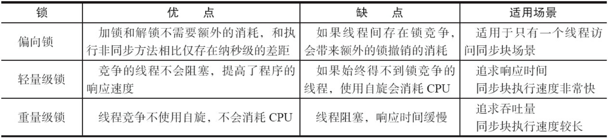

# 一、Synchronized

## 1. 使用方法

synchronized 块是 Java 提供的一种原子性内置锁，Java 中的每个对象都可以把它当作一个同步锁来使用，这些 Java 内置的使用者看不到的锁被称为内部锁，也叫作监视器锁。线程的执行代码在进入 synchronized 代码块前会自动获取内部锁，这时候其他线程访问该同步代码块时会被阻塞挂起。

具体表现为以下 3 种形式：

- 普通同步方法，锁是当前实例对象。
- 静态同步方法，锁是当前类的 Class 对象。
- 同步方法块，锁是 synchronized 括号里配置的对象。

## 2. 实现原理

### Ⅰ. 对象锁(Monitor)机制

synchronized 同步语句块的实现使用的是 monitorenter 和 monitorexit 指令，其中 monitorenter 指令指向同步代码块的开始位置，monitorexit 指令指向同步代码块的结束为止与异常位置。任何对象都有一个 monitor 与之关联，当且一个 monitor 被持有后，它将处于锁定状态。线程执行到 monitorenter 指令时，将会尝试获取对象所对应的 monitor 的所有权，即尝试获得对象的锁。

synchronized 修饰的方法并没有 monitorenter 指令和 monitorexit 指令，取得代之的是 ACC_SYNCHRONIZED 标识，该标识指明了该方法是一个同步方法，JVM 通过该 ACC_SYNCHRONIZED 访问标志来判断一个方法是否声明为同步方法，从而执行相应的同步调用。

synchronized 先天具有重入性，每个对象拥有一个计数器，当线程获取该对象锁后，计数器就会加一，释放锁后就会将计数器减一。

### Ⅱ. 获取与释放锁的内存语义

当线程释放锁时，JMM 会把该线程对应的本地内存中的共享变量刷新到主内存中。

- 线程 A 释放一个锁，实质上是线程 A 向接下来将要获取这个锁的某个线程发出了(线程 A 对共享变量所做修改的)消息。
- 线程 B 获取一个锁，实质上是线程 B 接收了之前某个线程发出的(在释放这个锁之前对共享变量所做的修改的)消息。
- 线程 A 释放锁，随后线程 B 获取这个锁，这个过程实质上是线程 A 通过主内存向线程 B 发送消息。

## 3. CAS 操作

CAS 即 Compare ans Swap，是 JDK 提供的非阻塞原子性操作，它通过硬件保证了「比较—更新」操作的原子性。CAS 操作是一种乐观锁策略，它假设没有线程访问共享资源的时候不会出现冲突，既然不会出现冲突自然就不会阻塞其它线程的操作。

### Ⅰ. 操作过程

CAS 操作的过程可以通俗的理解为 CAS(V,O,N)，包含三个值分别为：V 内存地址存放的实际值；O 预期的值（旧值）；N 更新的新值。当 V 和 O 相同时，也就是说旧值和内存中实际的值相同表明该值没有被其它线程更改过，即该旧值 O 就是目前来说最新的值了，自然而然可以将新值N赋值给 V。反之，V 和 O 不相同，表明该值已经被其它线程改过了则该旧值 O 不是最新版本的值了，所以不能将新值 N 赋给 V，返回 V 即可。当多个线程使用 CAS 操作一个变量时，只有一个线程会成功，并成功更新，其余都会失败。失败的线程会重新尝试，当然也可以选择挂起线程。

CAS 的实现需要硬件指令集的支撑，在 JDK1.5 后虚拟机才可以使用处理器提供的 **CMPXCHG** 指令实现。

### Ⅱ. 存在问题

（1）ABA 问题

CAS 会在操作值的时候检查值有没有变化，如果没有发生变化则更新，但是如果一个值原来是 A，变成了 B，又变成了 A，那么使用 CAS 进行检查时会发现它的值没有发生变化，但是实际上却变化了。这一问题可以通过添加版本号的方式解决，JDK 1.5 后 Atomic 包中提供了 AtomicStampedReference 来解决 ABA 问题。

（2）循环时间长开销大

自旋 CAS 如果长时间不成功，会给 CPU 带来非常大的执行开销。如果 JVM 能支持处理器提供的 pause 指令，效率会有一定的提升。

（3）只能保证一个共享变量的原子操作

当对一个共享变量执行操作时，可以使用循环 CAS 的方式保证原子操作，但是对多个共享变量操作时，循环 CAS 就无法保证操作的原子性，这个时候就可以用锁。

## 4. Java 对象头

synchronized 用的锁存在 Java 对象头里，Java 对象头里的 Mark Word 里默认存储对象的 HashCode、分代年龄和锁标记位。

   
 

## 5. 锁优化

JDK 1.6 中，锁共有 4 种状态，级别从低到高依次是：无锁状态、偏向锁状态、轻量级锁状态和重量级锁状态，这几个状态会随着竞争情况逐渐升级，锁可以升级，但不能降级。

### Ⅰ. 偏向锁

引入前提：大多数情况下，锁不仅不存在多线程竞争，而且总是由同一线程多次获得。

偏向锁的思想是偏向于让第一个获取锁对象的线程，这个线程在之后获取该锁就不再需要进行同步操作，甚至连 CAS 操作也不再需要。

当锁对象第一次被线程获得的时候，进入偏向状态。同时使用 CAS 操作将线程 ID 记录到 Mark Word 中，如果 CAS 操作成功，这个线程以后每次进入这个锁相关的同步块就不需要再进行任何同步操作。

当有另外一个线程去尝试获取这个锁对象时，偏向状态就宣告结束，此时撤销偏向（Revoke Bias）后恢复到未锁定状态或者轻量级锁状态。

### Ⅱ. 轻量级锁

引入前提：绝大部分的线程在获得锁以后，在非常短的时间内会去释放锁。

线程在执行同步块之前，JVM 会先在当前线程的栈桢中创建用于存储锁记录的空间，并将对象头中的 Mark Word 复制到锁记录中，官方称为 Displaced Mark Word。然后线程尝试使用 CAS 将对象头中的Mark Word替换为指向锁记录的指针。如果成功，当前线程获得锁，如果失败，表示其它线程竞争锁，当前线程便尝试使用自旋来获取锁。

轻量级解锁时，会使用原子的 CAS 操作将 Displaced Mark Word 替换回到对象头，如果成功，则表示没有竞争发生。如果失败，表示当前锁存在竞争，锁就会膨胀成重量级锁。

### Ⅲ. 比较

   
 

# 二、volatile

被 volatile 修饰的变量能够保证每个线程都能够获取该变量的最新值，从而避免出现数据脏读的现象。

## 1. 实现原理

有 volatile 变量修饰的共享变量进行写操作的时候会多出 Lock 前缀指令，Lock 前缀指令在多核处理器下会有两个影响：

- 将当前处理器缓存行的数据写回到系统内存。
- 这个写回内存的操作会使其它 CPU 里缓存了该内存地址的数据无效。

在多处理器下，为了保证各个处理器的缓存是一致的，就会实现缓存一致性协议，每个处理器通过嗅探在总线上传播的数据来检查自己缓存的值是不是过期了，当处理器发现自己缓存行对应的内存地址被修改，就会将当前处理器的缓存行设置成无效状态，当处理器对这个数据进行修改操作的时候，会重新从系统内存中把数据读到处理器缓存里。

## 2. 内存语义

当写一个 volatile 变量时，JMM 会把该线程对应的本地内存中的共享变量值刷新到主内存。

当读一个 volatile 变量时，JMM 会把该线程对应的本地内存置为无效。线程将从主内存中读取共享变量。

### 实现

为了实现 volatile 内存语义，Java 编译器会在生成指令时在适当位置添加内存屏障来禁止编译器重排序和处理器重排序。对于编译器来说，发现一个最优布置来最小化插入屏障的总数几乎是不可能的，为此，JMM采取了保守策略：

- 在每个 volatile 写操作的前面插入一个 StoreStore 屏障。
- 在每个 volatile 写操作的后面插入一个 StoreLoad 屏障。
- 在每个 volatile 读操作的后面插入一个 LoadLoad 屏障。
- 在每个 volatile 读操作的后面插入一个 LoadStore 屏障。

需要注意的是：volatile 写是在前面和后面分别插入内存屏障，而 volatile 读操作是在后面插入两个内存屏障。

- StoreStore 屏障：禁止上面的普通写和下面的 volatile 写重排序。

- StoreLoad 屏障：防止上面的 volatile 写与下面可能有的 volatile 读/写重排序。

- LoadLoad 屏障：禁止下面所有的普通读操作和上面的 volatile 读重排序。

- LoadStore 屏障：禁止下面所有的普通写操作和上面的 volatile 读重排序。

# 三、final

final 可以修饰变量、方法和类，用于表示所修饰的内容一旦赋值之后就不会再被改变。

## 1. 基本类型-重排序规则

### Ⅰ. 写 final 域

写 final 域的重排序规则禁止对 final 域的写重排序到构造函数之外：

- JMM 禁止编译器把 final 域的写重排序到构造函数之外。
- 编译器会在 final 域写之后，构造函数 return 之前，插入一个 StoreStore 屏障，禁止处理器把 final 域的写重排序到构造函数之外。

写 final 域的从排序规则可以确保在对象引用为任意线程可见之前，对象的 final 域已经被正确初始化过，而普通域不具备这个保障。

### Ⅱ. 读 final 域

在一个线程中，初次读对象引用和初次读该对象包含的 final 域，JMM 会禁止这两个操作重排序，处理器会在 final 域操作前面插入一个 LoadLoad 屏障。

读 final 域的重排序规则可以确保在读一个对象的 final 域之前，一定会先读这个包含这个 final 域的对象的引用。

## 2. 引用类型-重排序规则

在构造函数内对一个 final 引用的对象的成员域的写入，与随后在构造函数外把这个被构造对象的引用赋值给一个引用变量，这两个操作之间不能重排序。

## 3. 实现原理

在 final 域写之后，构造函数返回之前插入一个 StoreStore 屏障；读 final 域的操作前插入一个 LoadLoad 屏障。

### final 引用不能从构造函数内「溢出」

写 final 域的重排序规则可以确保：在引用变量为任意线程可见之前，该引用变量指向的对象的 final 域已经在构造函数中被正确初始化过了。但是，要得到这个效果，还需要一个保证：在构造函数内部，不能让这个构造对象的引用为其它线程所见，也就是对象引用不能再构造函数中「溢出」。

因为有可能在 final 还没有赋值之前其它线程就拿到了该对象的引用。