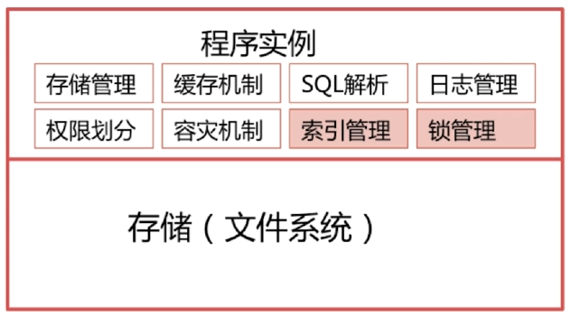

## 1. 数据库的三范式是什么？

- **第一范式：列不可拆分**

```sql
-- address 可以继续拆分为 国家、省份、地区  不满足第一范式
create table student(
	id int primary key,
    name varchar(20),
    address varchar(30)
)
```

- **第二范式：满足第一范式前提下，除主键外的每一列都必须完全依赖于主键，也就是每个表只描述一件事**

```sql
-- customer_name 只与 customer_id 有关，也就是除主键以外的其他列，只依赖于主键的部分字段。
create table myorder(
	product_id int,
    customer_id int,
    product_name varchar(20),
    customer_name varchar(20),
    primary key(product_id, customer_id)
);
```

可以拆分为：

```sql
-- 订单表
create table myorder(
	order_id int primary key,
    product_id int,
    customer_id int
);
-- 产品表
create table product(
	id int primary key,
    name varchar(20)
);
-- 消费者表
create table customer(
	id int primary key,
    name varchar(20)
);
```

- **第三范式：满足第二范式的前提下，除开主键列的其他列之间不能有传递依赖关系**

```sql
-- customer_phone 与非主键的 customer_id 存在依赖关系，不满足第三范式
create table myorder(
	order_id int primary key,
    product_id int,
    customer_id int,
    customer_phone varchar(15)
);
```

# 一、事务

## 1. 概念

事务是指满足 ACID 特性的一组操作，可以通过 Commit 提交一个事务，也可以使用 Rollback 进行回滚。

## 2. 事务的特性（ACID）

#### I. 原子性（Atomicity）

事务是最小的执行单位，不允许分割。事务的原子性确保动作要么全部完成，要么完全不起作用。

#### II. 一致性（Consistency）

执行事务前后，数据保持一致，多个事务对同一个数据读取的结果是相同的。

一致性是指数据处于一种语义上有意义且正确的状态。

例如，A 和 B 账户中共有 500 + 500 = 1000 元，转账后，A 和 B 账户的还是共有 400 + 600 = 1000 元。也就是说，数据的状态在执行该事务后从一个状态改变到了另外一个状态。同时一致性还能保证账户余额不会变成负数等。

#### III. 隔离性（Isolation）

并发访问数据库时，一个用户的事务不被其他事务所干扰，各并发事务之间数据库是独立的。

#### IV. 持久性（Durability）

一个事务被提交之后。它对数据库中数据的改变是持久的，即使数据库发生故障也不应该对其有任何影响。使用重做日志来保证持久性。

## 3. MySQL 事务

MySQL 默认采用自动提交模式，如果不显式开始一个事务，每个查询都会被当做一个事务自动提交。

```mysql
begin / start transaction				-- 手工开启事务
commit / rollback						-- 事务提交或回滚
set session autocommit = on / off		-- 设定事务是否自动开启
```

## 4. 并发事务

多个事务并发运行可能会导致以下问题：

#### I. 丢失修改

指在一个事务读取一个数据时，另外一个事务也访问了该数据，那么在第一个事务中修改了这个数据后，第二个事务也修改了这个数据。这样第一个事务内的修改结果就被丢失，因此称为丢失修改。	例如：事务 1 读取某表中的数据 A = 20，事务 2 也读取A = 20，事务 1 修改 A = A - 1，事务 2 也修改 A = A - 1，最终结果 A = 19，事务 1 的修改被丢失。

#### II. 脏读

当一个事务正在访问数据并且对数据进行了修改，而这种修改还没有提交到数据库中，这时另外一个事务也访问了这个数据，然后使用了这个数据。因为这个数据是还没有提交的数据，那么另外一个事务读到的这个数据是“脏数据”，依据“脏数据”所做的操作可能是不正确的。

#### III. 不可重复读

指在一个事务内多次读同一数据。在这个事务还没有结束时，另一个事务也访问该数据。那么，在第一个事务中的两次读数据之间，由于第二个事务的修改导致第一个事务两次读取的数据可能不太一样。这就发生了在一个事务内两次读到的数据是不一样的情况，因此称为不可重复读。

#### IV. 幻读

幻读与不可重复读类似。它发生在一个事务（T1）读取了几行数据，接着另一个并发事务（T2）插入了一些数据时。在随后的查询中，第一个事务（T1）就会发现多了一些原本不存在的记录，就好像发生了幻觉一样，所以称为幻读。

------

产生并发不一致性问题主要原因是破坏了事务的隔离性，解决方法是通过并发控制来保证隔离性。并发控制可以通过封锁来实现，但是封锁操作需要用户自己控制，相当复杂。数据库管理系统提供了事务的隔离级别，让用户以一种更轻松的方式处理并发一致性问题。

## 5. 事务隔离级别

#### I. 未提交读（READ UNCOMMITTED）

事务中的修改，即使没有提交，对其它事务也是可见的。

#### II. 提交读（READ COMMITTED）

一个事务只能读取已经提交的事务所做的修改。换句话说，一个事务所做的修改在提交之前对其它事务是不可见的。

#### III. 可重复读（REPEATABLE READ）

保证在同一个事务中多次读取同样数据的结果是一样的。

#### IV. 可串行化（SERIALIZABLE）

最高的隔离级别，完全服从 ACID 的隔离级别。

------

| 隔离级别 | 脏读 | 不可重复读 | 幻影读                |
| -------- | ---- | ---------- | --------------------- |
| 未提交读 | √    | √          | √                     |
| 提交读   | ×    | √          | √                     |
| 可重复读 | ×    | ×          | √（对 InnoDB 不可能） |
| 可串行化 | ×    | ×          | ×                     |

MySQL InnoDB 存储引擎默认支持的隔离级别是 REPEATABLE READ 可重复读。

隔离级别越低，事务请求的锁越少，所以大部分数据库系统的隔离级别都是 READ COMMITTED 提交读。

# 二、锁

## 1. InnoDB 行锁

InnoDB 的行锁是通过给索引上的索引项加锁来实现的。

只有通过索引条件进行数据检索，InnoDB 才使用行级锁，否则，InnoDB 使用表锁（锁住索引的所有记录）。

## 2. 锁类型

### I. 读写锁

#### 共享锁（Shared）

简称 S 锁，多个事务对同一个数据可以共享一把锁，都能访问到数据，但是只能读不能修改。

```mysql
select * from users where id=1 lock in share mode;		-- 加锁
commit / rollback;										-- 释放
```

#### 排他锁（Exclusive）

简称 X 锁，排他锁不能与其他锁并存，如果一个事务获取了一个数据行的排他锁，其他事务就不能再获取该行的锁（共享锁、排他锁），只有该获取了排他锁的事务可以对数据进行读取和修改。

```mysql
delete / update / insert 							-- 默认加上 X 锁
select * from users where ... for update;			-- 加锁
commit / rollback;									-- 释放
```

### II. 意向锁

意向锁（IS、IX）是 InnoDB 数据操作之前自动加的，不需要用户干预。

当事务想去进行锁表时，可以先判断意向锁是否存在，存在时则可快速返回该表不能启用表锁。

### III. 自增锁

针对自增列自增长的一个特殊的表级别锁，默认取值为 1，代表连续，事务未提交 ID 永久丢失。

## 3. 锁算法

### I. 临键锁（Next-key）

锁住记录 + 区间（左开右闭），InnoDB 默认的行锁算法，解决幻读。

当 SQL 执行按照索引进行数据的检索时，查询条件为范围查找（between and、<、> 等）并有数据命中，则此时 

SQL 语句加上的锁为 Next-Key lock，锁住命中索引的记录 + 区间（左开右闭）。

### II. 间隙锁（Gap）

锁住数据不存在的区间（左开右开）。

当范围查询或等值查询记录不存在，临键锁退化成 Gap 锁。

Gap 只在 可重复读事务隔离级别存在。

### III. 记录锁

锁住具体的索引项。

当 SQL 执行按照唯一性（Primary key、Unique key）索引进行数据的检索时，查询条件等值匹配且查询的数据是存在的，这时 SQL 语句加上的锁为记录锁。

# 三、多版本并发控制（MVCC）

多版本并发控制（Multi-Version Concurrency Control, MVCC）是 MySQL 的 InnoDB 存储引擎实现隔离级别的一种具体方式，用于实现提交读和可重复读这两种隔离级别。而未提交读隔离级别总是读取最新的数据行，无需使用 MVCC。可串行化隔离级别需要对所有读取的行都加锁，单纯使用 MVCC 无法实现。

## 版本号

- 系统版本号：是一个递增的数字，每开始一个新的事务，系统版本号就会自动递增。
- 事务版本号：事务开始时的系统版本号。

## 隐藏的列

MVCC 在每行记录后面都保存着两个隐藏的列，用来存储两个版本号：

- 创建版本号：指示创建一个数据行的快照时的系统版本号；
- 删除版本号：如果该快照的删除版本号大于当前事务版本号表示该快照有效，否则表示该快照已经被删除了。

## Undo 日志

MVCC 使用到的快照存储在 Undo 日志中，该日志通过回滚指针把一个数据行（Record）的所有快照连接起来。

## 实现过程

以下实现过程针对可重复读隔离级别。

当开始一个事务时，该事务的版本号肯定大于当前所有数据行快照的创建版本号，理解这一点很关键。数据行快照的创建版本号是创建数据行快照时的系统版本号，系统版本号随着创建事务而递增，因此新创建一个事务时，这个事务的系统版本号比之前的系统版本号都大，也就是比所有数据行快照的创建版本号都大。

### 1. SELECT

多个事务必须读取到同一个数据行的快照，并且这个快照是距离现在最近的一个有效快照。但是也有例外，如果有一个事务正在修改该数据行，那么它可以读取事务本身所做的修改，而不用和其它事务的读取结果一致。

把没有对一个数据行做修改的事务称为 T，T 所要读取的数据行快照的创建版本号必须小于 T 的版本号，因为如果大于或者等于 T 的版本号，那么表示该数据行快照是其它事务的最新修改，因此不能去读取它。除此之外，T 所要读取的数据行快照的删除版本号必须大于 T 的版本号，因为如果小于等于 T 的版本号，那么表示该数据行快照是已经被删除的，不应该去读取它。

### 2. INSERT

将当前系统版本号作为数据行快照的创建版本号。

### 3. DELETE

将当前系统版本号作为数据行快照的删除版本号。

### 4. UPDATE

将当前系统版本号作为更新前的数据行快照的删除版本号，并将当前系统版本号作为更新后的数据行快照的创建版本号。可以理解为先执行 DELETE 后执行 INSERT。

# 四、索引

是一种为了加速对数据表中数据行的检索从而创建的分散存储的数据结构。

## 1. 为什么要使用索引？

MySQL 数据库存储数组最终是以文件的形式存储到硬盘的，一般来说，在程序中使用的时候肯定要把磁盘文件中的数据读到内存中，数据库动辄千万级的数据，读取数据花费的时间是巨大的，这时就可以通过创建索引的方式提升数据读取速率。

除此之外也可以将随机 IO 变为 顺序 IO。

## 2. 索引这么多优点，为什么不对表中的每一个列创建一个索引呢？

- 当对表中的数据进行增加、删除和修改的时候，索引也要动态维护，这就降低了数据的维护速度。
- 索引需要占物理空间，除了数据表占数据空间之外，每一个索引还要占一定的物理空间。如果需要建立聚簇索引，那么需要的空间就会更大。
- 创建索引和维护索引需要耗费时间，这种时间随着数据量的增加而增加。

## 3. 索引是如何提高查询速度的？

将无序的数据变成相对有序的数据（就像查目录一样）。

## 4. MySQL 索引使用的数据结构

- 哈希索引

底层的数据结构是哈希表，因此在绝大多数需求为单条记录查询的时候，可以选择哈希索引，查询性能最快。

InnoDB 存储引擎有一个特殊的功能叫“自适应哈希索引”，当某个索引值被使用的非常频繁时，会在 B+Tree 索引之上再创建一个哈希索引，这样就让 B+Tree 索引具有哈希索引的一些优点，比如快速的哈希查找。

- B+ - Tree 索引

是大多数 MySQL 存储引擎的默认索引类型。

因为不再需要进行全表扫描，只需要对树进行搜索即可，所以查找速度快很多。

因为 B+ Tree 的有序性，所以除了用于查找，还可以用于排序和分组。

可以指定多个列作为索引列，多个索引列共同组成键。

适用于全键值、键值范围和键前缀查找，其中键前缀查找只适用于最左前缀查找。如果不是按照索引列的顺序进行查找，则无法使用索引。

InnoDB 的 B+Tree 索引分为主索引和辅助索引。主索引的叶子节点 data 域记录着完整的数据记录，这种索引方式被称为聚簇索引。因为无法把数据行存放在两个不同的地方，所以一个表只能有一个聚簇索引。

## 5. 覆盖索引

一个索引包含所有需要查询的字段值。

对于 InnoDB 引擎，若辅助索引能够覆盖查询，则无需访问主索引。


# 五、数据库存储引擎

## InnoDB

是 MySQL 默认的事务型存储引擎，只有在需要它不支持的特性时，才考虑使用其它存储引擎。

实现了四个标准的隔离级别，默认级别是可重复读（REPEATABLE READ）。在可重复读隔离级别下，通过多版本并发控制（MVCC）+ 间隙锁（Next-Key Locking）防止幻影读。

主索引是聚簇索引，在索引中保存了数据，从而避免直接读取磁盘，因此对查询性能有很大的提升。

内部做了很多优化，包括从磁盘读取数据时采用的可预测性读、能够加快读操作并且自动创建的自适应哈希索引、能够加速插入操作的插入缓冲区等。

支持真正的在线热备份。其它存储引擎不支持在线热备份，要获取一致性视图需要停止对所有表的写入，而在读写混合场景中，停止写入可能也意味着停止读取。

## MyISAM

设计简单，数据以紧密格式存储。对于只读数据，或者表比较小、可以容忍修复操作，则依然可以使用它。

提供了大量的特性，包括压缩表、空间数据索引等。

不支持事务。

不支持行级锁，只能对整张表加锁，读取时会对需要读到的所有表加共享锁，写入时则对表加排它锁。但在表有读取操作的同时，也可以往表中插入新的记录，这被称为并发插入（CONCURRENT INSERT）。

可以手工或者自动执行检查和修复操作，但是和事务恢复以及崩溃恢复不同，可能导致一些数据丢失，而且修复操作是非常慢的。

如果指定了 DELAY_KEY_WRITE 选项，在每次修改执行完成时，不会立即将修改的索引数据写入磁盘，而是会写到内存中的键缓冲区，只有在清理键缓冲区或者关闭表的时候才会将对应的索引块写入磁盘。这种方式可以极大的提升写入性能，但是在数据库或者主机崩溃时会造成索引损坏，需要执行修复操作。

## 比较

- 并发：MyISAM 只支持表级锁；而 InnoDB 支持行级锁和表级锁，默认为行级锁。
- 事务：MyISAM 强调的是性能，每次查询具有原子性，执行速度比 InnoDB 更快，但不提供事务支持；InnoDB 提供事务支持、外键等高级数据库功能。
- 外键：MyISAM 不支持外键；InnoDB 支持外键。
- 备份：InnoDB 支持在线热备份。
- 崩溃恢复：MyISAM 崩溃后发生损坏的概率比 InnoDB 高很多，而且恢复的速度也更慢。
- 其它特性：MyISAM 支持压缩表和空间数据索引。

# 如何设计一个关系型数据库

<div align="center">   </div><br>

## 参考

[事务隔离级别浅析](<http://geyifan.cn/2016/07/17/talk-about-transaction/>)

[CyC2018 - 数据库系统原理]([https://github.com/CyC2018/CS-Notes/blob/master/notes/%E6%95%B0%E6%8D%AE%E5%BA%93%E7%B3%BB%E7%BB%9F%E5%8E%9F%E7%90%86.md#acid](https://github.com/CyC2018/CS-Notes/blob/master/notes/数据库系统原理.md#acid))

[彻底理解数据库事务](<https://www.hollischuang.com/archives/898>)

