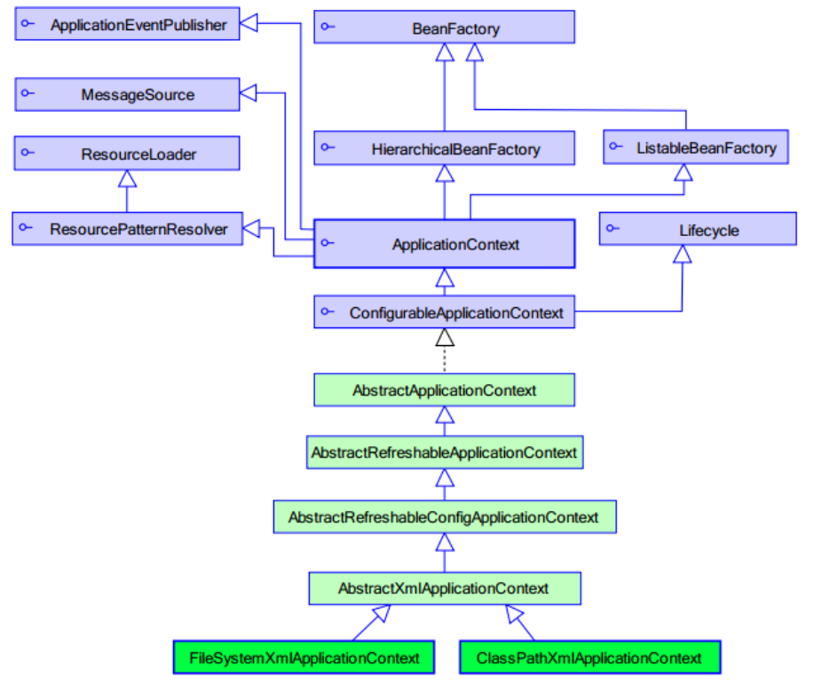

# 一、Spring 工厂类

加载配置文件后，会自动创建所有的对象。

<div align="center">   </div><br>

# 二、XML 实例化方式

## 1. 无参数构造器

```java
public class Bean1 {
    public Bean1() {
        System.out.println("Bean1 被实例化了...");
    }
}
```

配置文件。
```xml
<bean id="bean1" class="com.str818.ioc.demo2.Bean1"></bean>
```

测试方法。
```java
@Test
public void demo1() {
    ApplicationContext applicationContext = new ClassPathXmlApplicationContext("applicationContext.xml");
    Bean1 bean1 = (Bean1)applicationContext.getBean("bean1");
}
```

输出。
```
Bean1 被实例化了...
```

## 2. 静态工厂

```java
public class Bean2 {}
```

工厂类。
```java
public class Bean2Factory {
    public static Bean2 createBean2() {
        System.out.println("Bean2Factory的方法已经执行了...");
        return new Bean2();
    }
}
```

配置文件。
```xml
<bean id="bean2" class="com.str818.ioc.demo2.Bean2Factory" factory-method="createBean2"></bean>
```

测试方法。
```java
@Test
public void demo2() {
    ApplicationContext applicationContext = new ClassPathXmlApplicationContext("applicationContext.xml");
    Bean2 bean2 = (Bean2)applicationContext.getBean("bean2");
}
```

输出。
```
Bean2Factory的方法已经执行了...
```

## 3. 实例工厂

```java
public class Bean3 {}
```

实例工厂。
```java
public class Bean3Factory {
    public Bean3 createBean3 () {
        System.out.println("Bean3Factory的方法已经执行了..");
        return new Bean3();
    }
}
```

配置文件。
```xml
<bean id="bean3Factory" class="com.str818.ioc.demo2.Bean3Factory"></bean>
<bean id="bean3" factory-bean="bean3Factory" factory-method="createBean3"></bean>
```

测试方法。
```java
@Test
public void demo3() {
    ApplicationContext applicationContext = new ClassPathXmlApplicationContext("applicationContext.xml");
    Bean3 bean3 = (Bean3)applicationContext.getBean("bean3");
}
```

输出。
```
Bean3Factory的方法已经执行了...
```

# 三、Bean 的配置项与作用域

## 1. 配置项

Spring 中所有的对象都称为 Bean。

- id：IOC 容器中 Bean 的唯一标识，name 中可以包含特殊字符，效果与 id 相同
- class：用于设置一个类的完全路径
- scope：作用域
- constructor arguments：构造器参数
- properties：属性
- autowiring mode：自动装配模式
- lazy-initialization mode：懒加载模式
- initializaton/destruction mothod：初始化和销毁方法

## 2. 作用域

- singleton：单例，默认方式，指一个 Bean 容器中只存在一份。
- prototype：每次请求（每次使用）创建新的实例，destroy 方式不生效。
- request：每次 http 请求创建一个实例且仅在当前 request 内有效。
- session：每次 http 请求创建，在当前 session 内有效。
- global session：基于 protlet 的 web 中有效，如果是在 web 中，同 session。

```xml
<bean id="test" class="com.str818.bean.test" scope="singleton"></bean>
```

## 3. 全局配置

在配置文件中设置可选的默认初始化与销毁方法。

```xml
<beans xmlns="http://www.springframework.org/schema/beans"
       xmlns:xsi="http://www.w3.org/2001/XMLSchema-instance"
       xsi:schemaLocation="http://www.springframework.org/schema/beans
       http://www.springframework.org/schema/beans/spring-beans.xsd"
       default-init-method="init" default-destroy-method="destroy">
</beans>
```


# 四、Bean 的生命周期

## 1. 全部生命周期

1. instantiate bean 对象实例化
2. populate prpperties 封装属性
3. 如果 Bean 实现 BeanNameAware 执行 setBeanName()
4. 如果 Bean 实现 BeanFactoryAware 或者 ApplicationContextAware 设置工厂 setBeanFactory() 或者上下文对象 setApplicationContext()
5. 如果存在类实现 BeanPostProcessor (后处理 Bean)，执行 postProcessBeforeInitialization()
6. 如果 Bean 实现 InitializingBean 执行 afterPropertiesSet()
7. 调用 `<bean init-method="init>` 执行初始化方法 init()
8. 如果存在类实现 BeanPostProcessor (处理 Bean)，执行 postProcessAfterInitialization()
9. 执行业务处理
10. 如果 Bean 实现 DisposableBean 执行 destroy()
11. 调用 `<bean destroy-method="customerDestroy>` 执行销毁方法 customerDestroy()

```java
public class Man implements BeanNameAware,ApplicationContextAware,InitializingBean,DisposableBean{
    private String name;

    public void setName(String name) {
        System.out.println("第二步：设置属性");
        this.name = name;
    }

    public Man(){
        System.out.println("第一步：初始化...");
    }
    public void setup(){
        System.out.println("第七步：MAN被初始化了...");
    }

    public void teardown(){
        System.out.println("第十一步：MAN被销毁了...");
    }

    @Override
    public void setBeanName(String name) {
        System.out.println("第三步：设置Bean的名称" + name);
    }

    @Override
    public void setApplicationContext(ApplicationContext applicationContext) throws BeansException {
        System.out.println("第四步：了解工厂信息");
    }

    @Override
    public void afterPropertiesSet() throws Exception {
        System.out.println("第六步：属性设置后");
    }

    public void run(){
        System.out.println("第九步：执行业务方法");
    }

    @Override
    public void destroy() throws Exception {
        System.out.println("第十步：执行Spring的销毁方法");
    }
}
```

```java
public class MyBeanPostProcessor implements BeanPostProcessor {
    @Override
    public Object postProcessBeforeInitialization(Object bean, String beanName) throws BeansException {
        System.out.println("第五步：初始化前方法...");
        return bean;
    }

    @Override
    public Object postProcessAfterInitialization(final Object bean, String beanName) throws BeansException {
        System.out.println("第八步：初始化后方法...");
        return bean;
    }
}
```

测试方法。
```java
@Test
public void demo(){
    ClassPathXmlApplicationContext applicationContext = new ClassPathXmlApplicationContext("applicationContext.xml");
    Man man = (Man)applicationContext.getBean("man");
    man.run();
    applicationContext.close();
}
```

配置文件。
```xml
<bean id="man" class="com.str818.ioc.Man" init-method="setup" destroy-method="teardown">
    <property name="name" value="str818"/>
</bean>
<bean class="com.str818.ioc.MyBeanPostProcessor"
```

## 2. BeanPostProcessor 的作用

BeanPostProcessor 能够在不改变原有代码的前提前增强一个类中的方法。

用户增删改查接口。
```java
public interface UserDao {
    public void findAll();
    public void save();
    public void update();
    public void delete();
}
```

增删改查具体实现。
```java
public class UserDaoImpl implements UserDao {
    @Override
    public void findAll() {
        System.out.println("查询用户。。。");
    }

    @Override
    public void save() {
        System.out.println("保存用户。。。");
    }

    @Override
    public void update() {
        System.out.println("修改用户。。。");
    }

    @Override
    public void delete() {
        System.out.println("删除用户。。。");
    }
}
```
BeanPostProcessor 类。
```java
public class MyBeanPostProcessor implements BeanPostProcessor {
    @Override
    public Object postProcessBeforeInitialization(Object bean, String beanName) throws BeansException {
        return bean;
    }

    @Override
    public Object postProcessAfterInitialization(final Object bean, String beanName) throws BeansException {
        // 在保存用户方法执行之前进行「权限校验」
        if("userDao".equals(beanName)){
            Object proxy = Proxy.newProxyInstance(bean.getClass().getClassLoader(), bean.getClass().getInterfaces(), new InvocationHandler() {
                @Override
                public Object invoke(Object proxy, Method method, Object[] args) throws Throwable {
                    if("save".equals(method.getName())){
                        System.out.println("==========权限校验=========");
                        return method.invoke(bean,args);
                    }
                    return method.invoke(bean,args);
                }
            });
            return proxy;
        }else{
            return bean;
        }
    }
}
```

# 五、属性注入

## 1. 构造方法注入

```java
public class User {
    private String name;
    private Integer age;

    public User(String name,Integer age){
        this.name = name;
        this.age = age;
    }

    @Override
    public String toString() {
        return "User{" +
                "name='" + name + '\'' +
                ", age=" + age +
                '}';
    }
}
```

```xml
<bean id="user" class="com.str818.ioc.User">
    <constructor-arg name="name" value="张三" />
    <constructor-arg name="age" value="22"/>
</bean>
```

测试方法。
```java
@Test
public void demo(){
    ApplicationContext applicationContext = new ClassPathXmlApplicationContext("applicationContext.xml");
    User user = (User)applicationContext.getBean("user");
    System.out.println(user);
}
```

## 2. Set 方法注入

```java
public class Person {
    private String name;
    private Integer age;

    private Cat cat;

    public String getName() {
        return name;
    }

    public void setName(String name) {
        this.name = name;
    }

    public Integer getAge() {
        return age;
    }

    public void setAge(Integer age) {
        this.age = age;
    }

    public Cat getCat() {
        return cat;
    }

    public void setCat(Cat cat) {
        this.cat = cat;
    }

    @Override
    public String toString() {
        return "Person{" +
                "name='" + name + '\'' +
                ", age=" + age +
                ", cat=" + cat +
                '}';
    }
}
```

```java
public class Cat {
    private String name;

    public String getName() {
        return name;
    }

    public void setName(String name) {
        this.name = name;
    }

    @Override
    public String toString() {
        return "Cat{" +
                "name='" + name + '\'' +
                '}';
    }
}
```

```xml
<bean id="person" class="com.str818.ioc.Person">
    <property name="name" value="李四"/>
    <property name="age" value="32"/>
    <property name="cat" ref="cat"/>
</bean>
<bean id="cat" class="com.str818.ioc.Cat">
    <property name="name" value="ketty"/>
</bean>
```

## 3. p 名称空间注入

引入新的 p 名称空间，能够简化 XML 文件配置。

```xml
<beans xmlns:p="http://www.springframework.org/schema/p">
    <bean id="person" class="com.imooc.ioc.demo4.Person" p:name="大黄" p:age="34" p:cat-ref="cat"/>
    <bean id="cat" class="com.imooc.ioc.demo4.Cat" p:name="小黄"/>
</beans>
```

## 4. SpEL 注入

SpEL：Spring Expression Language，Spring 表达式语言，对依赖注入进行简化。

语法：`#{表达式}`

`<bean id="" value="#{表达式}">`

- #{'hello'}：使用字符串

- #{beanId}：使用另一个 bean

- #{beanId.content.toUpperCase()}：使用方法

- #{T(java.lang.Math.PI)}：使用静态字段或方法


类别类。
```java
public class Category {
    private String name;

    public String getName() {
        return name;
    }

    public void setName(String name) {
        this.name = name;
    }

    @Override
    public String toString() {
        return "Category{" +
                "name='" + name + '\'' +
                '}';
    }
}
```

产品类。
```java
public class Product {
    private String name;
    private Double price;

    private Category category;

    public String getName() {
        return name;
    }

    public void setName(String name) {
        this.name = name;
    }

    public Double getPrice() {
        return price;
    }

    public void setPrice(Double price) {
        this.price = price;
    }

    public Category getCategory() {
        return category;
    }

    public void setCategory(Category category) {
        this.category = category;
    }

    @Override
    public String toString() {
        return "Product{" +
                "name='" + name + '\'' +
                ", price=" + price +
                ", category=" + category +
                '}';
    }
}

```

产品信息类，计算产品价格。
```java
public class ProductInfo {
    public Double calculatePrice(){
        return Math.random() * 199;
    }
}
```

配置文件。
```xml
<bean id="category" class="com.str818.ioc.Category">
    <property name="name" value="#{'服装'}"/>
</bean>

<bean id="productInfo" class="com.str818.ioc.ProductInfo"/>

<bean id="product" class="com.str818.ioc.Product">
    <property name="name" value="#{'男装'}"/>
    <property name="price" value="#{productInfo.calculatePrice()}"/>
    <property name="category" value="#{category}"/>
</bean>
```

## 5. 复杂类型的注入

前面四种注入方式都针对的是简单类型，下面分别针对数组、List、Set、Map 与 Properties 类型的属性进行注入。

```java
public class CollectionBean {
    private String[] arrs; // 数组类型

    private List<String> list;// List集合类型

    private Set<String> set; // Set集合类型

    private Map<String,Integer> map;// Map集合类型

    private Properties properties; // 属性类型

    public String[] getArrs() {
        return arrs;
    }

    public void setArrs(String[] arrs) {
        this.arrs = arrs;
    }

    public List<String> getList() {
        return list;
    }

    public void setList(List<String> list) {
        this.list = list;
    }

    public Set<String> getSet() {
        return set;
    }

    public void setSet(Set<String> set) {
        this.set = set;
    }

    public Map<String, Integer> getMap() {
        return map;
    }

    public void setMap(Map<String, Integer> map) {
        this.map = map;
    }

    public Properties getProperties() {
        return properties;
    }

    public void setProperties(Properties properties) {
        this.properties = properties;
    }

    @Override
    public String toString() {
        return "CollectionBean{" +
                "arrs=" + Arrays.toString(arrs) +
                ", list=" + list +
                ", set=" + set +
                ", map=" + map +
                ", properties=" + properties +
                '}';
    }
}
```
```xml
<bean id="collectionBean" class="com.str818.ioc.CollectionBean">
    <!--数组类型-->
    <property name="arrs">
        <list>
            <value>aaa</value>
            <value>bbb</value>
            <value>ccc</value>
        </list>
    </property>
    <!--List集合的属性注入-->
    <property name="list">
        <list>
            <value>111</value>
            <value>222</value>
            <value>333</value>
        </list>
    </property>
    <!--Set集合的属性注入-->
    <property name="set">
        <set>
            <value>ddd</value>
            <value>eee</value>
            <value>fff</value>
        </set>
    </property>
    <!--Map集合的属性注入-->
    <property name="map">
        <map>
            <entry key="aaa" value="111"/>
            <entry key="bbb" value="222"/>
            <entry key="ccc" value="333"/>
        </map>
    </property>
    <!--Properties的属性注入-->
    <property name="properties">
        <props>
            <prop key="username">root</prop>
            <prop key="password">1234</prop>
        </props>
    </property>
</bean>
```

## 6. 自动装配

Spring 容器可以在不使用 `<constructor-arg>` 和 `<property>` 元素的情况下自动装配相互协作的 bean 之间的关系。只需要在 `<bean>` 中定义 autowire 属性。

```xml
<bean id="customer" class="com.str818.bean.Customer" autowire="byName" />
```

在Spring中，支持 5 自动装配模式。
	
- no：缺省情况下，自动配置是通过 ref 属性手动设定
- byName：根据属性名称自动装配。如果一个 bean 的名称和其他 bean 属性的名称是一样的，将会自装配它。
- byType：按数据类型自动装配。如果容器中存在一个与指定属性类型相同的 bean，那么将与该属性自动装配；如果存在多个该类型的 bean，那么抛出异常，并指出不能使用 byType 方式进行自动装配。
- constructor：与 byType 方式类似，不同之处在于它应用于构造器参数。
- autodetect：如果找到默认的构造函数，使用 constructor; 否则，使用 byType。

# 六、注解方式管理Bean

## 1. 注解管理

@Component 描述 Spring 框架中的 Bean，除了 @Component 外，Spring 提供 3 个功能基本和 @Component 等效的注解：

- @Repository 用于对 DAO 实现进行标注
- @Service 用于对 Service 实现类进行标注
- @Controller 用于对 Controller 实现类进行标注

```java
@Repository("userDao")
public class UserDao {
    public void save(){
        System.out.println("DAO中保存用户...");
    }
}
```

```xml
<?xml version="1.0" encoding="UTF-8"?>
<beans xmlns="http://www.springframework.org/schema/beans"
       xmlns:xsi="http://www.w3.org/2001/XMLSchema-instance"
       xmlns:context="http://www.springframework.org/schema/context" xsi:schemaLocation="
        http://www.springframework.org/schema/beans http://www.springframework.org/schema/beans/spring-beans.xsd
        http://www.springframework.org/schema/context http://www.springframework.org/schema/context/spring-context.xsd">

    <!--开启注解扫描=======================-->
    <context:component-scan base-package="com.str818"/>
</beans>
```

## 2. 属性注入

### I. value

对于普通的属性，使用 Value 即可注入，不需要 Set 与 Get 方法。

```java
@Service("userService")
public class UserService {
    @Value("米饭")
    private String something;
}
```

### II. 按类型注入

@Autowired 会根据类型自动注入。

```java
@Repository("userDao")
public class UserDao {
    public void save(){
        System.out.println("DAO中保存用户...");
    }
}
```

```java
@Service("userService")
public class UserService {
    @Autowired
    private UserDao userDao;

    public void save(){
        System.out.println("Service中保存用户...");
        userDao.save();
    }
}
```

### III. 按名称注入

一起使用 @Autowired 和 @Qualifier("name") 能够按照名称进行注入，与单独使用 @Resource(name="name") 效果相同。

```java
@Repository("userDao")
public class UserDao {
    public void save(){
        System.out.println("DAO中保存用户...");
    }
}
```

```java
@Service("userService")
public class UserService {
    @Autowired
    @Qualifier("userDao")
    // @Resource(name="userDao")
    private UserDao userDao;

    public void save(){
        System.out.println("Service中保存用户...");
        userDao.save();
    }
}
```

## 4. 其他注解

### I. @PostConstruct 和 @PreDestroy

这两个注解的作用相当于 `<bean id="xxx" class="..." init-method="init" destroy-method="destroy" />` 中的 init-method 与 destroy-method 设置的两个方法。

```java
@Component("bean")
public class Bean {

    @PostConstruct
    public void init(){
        System.out.println("initBean...");
    }

    public void say(){
        System.out.println("say...");
    }

    @PreDestroy
    public void destory(){
        System.out.println("destoryBean...");
    }
}
```

### II. @Scope

```java
@Component("bean")
@Scope("prototype")
public class Bean {

}
```

# 七、注解与XML配置方式的混合使用

在配置文件中添加 `<context:annotation-config/>` 对注解进行扫描。

# 八、Resource

在使用 Spring 作为容器进行项目开发中会有很多的配置文件，这些文件都是通过 Spring 的 Resource 接口来实现加载的。

- ClassPathResource：通过类路径获取资源文件
- FileSystemResource：通过文件系统获取资源
- UrlResource：通过URL地址获取资源
- ByteArrayResource：获取字节数组封装的资源
- ServletContextResource：获取ServletContext环境下的资源
- InputStreamResource：获取输入流封装的资源

```java
Resource resource = new ClassPathResource("test.txt");
System.out.println(resource.contentLength());
System.out.println(resource.lastModified());
```


