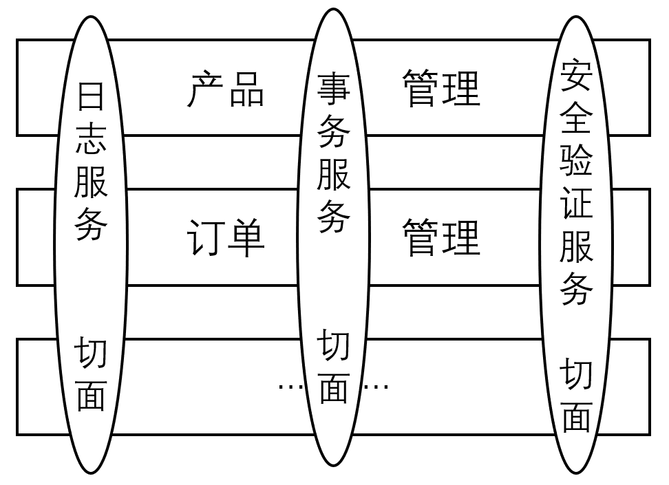

# 一、什么是 AOP

AOP 是 Aspect Oriented Programming 的缩写，意为：面向切面编程，通过预编译方式和运行期动态代理实现程序功能的统一维护的一种技术。

主要功能是：日志记录、性能统计、安全控制、事务处理与异常处理等。

AOP 采取横向抽取机制，取代了传统纵向继承体系重复性代码；其使用纯 Java 实现，不需要专门的编译过程和类加载器，在运行期通过代理方式向目标类织入增强代码。


# 二、相关术语

```java
public class UnerDaoImpl implements UserDao {
    public void save(User user) {}
    public void update(User user) {}
    public List find(){}
    public void delete(User user) {}
}
```

## 1. 连接点(Jointpoint)

可以被拦截到的点，「增删改查」四个方法都可以被增强，这些方法被称为连接点。

## 2. 切入点(Pointcut)

真正被拦截到的点。

若只想对 save 方法进行增强（做权限校验），save 方法称为切入点。

## 3. 通知(Advice)

拦截后要做的事情。

若对 save 方法进行权限校验，权限校验的方法称为通知。

## 4. 目标(Target)

被增强的对象，这里被增强的 UnerDaoImpl 对象称为目标。

## 5. 织入(Weaving)

将 Advice 应用到 Target 的过程。

将权限校验应用到 UnerDaoImpl 的 save 方法的这个过程。

## 6. 代理(Proxy)

被应用增强后，产生了一个代理对象。

## 7. 切面(Aspect)

切入点和通知的组合。

<div align="center">   </div><br>

# 三、底层实现

## 1. JDK 动态代理

通过 JDK 动态代理的方式在调用 save 方法之前进行权限校验。

用户数据处理接口。
```java
public interface UserDao {
    public void save();
    public void update();
    public void delete();
    public void find();
}
```

用户数据处理实现类。
```java
public class UserDaoImpl implements UserDao{

    @Override
    public void save() {
        System.out.println("保存用户...");
    }

    @Override
    public void update() {
        System.out.println("修改用户...");
    }

    @Override
    public void delete() {
        System.out.println("删除用户...");
    }

    @Override
    public void find() {
        System.out.println("查询用户...");
    }
}
```

代理类。
```java
public class MyJdkProxy implements InvocationHandler {

    private UserDao userDao;

    public MyJdkProxy(UserDao userDao) {
        this.userDao = userDao;
    }

    public Object createProxy(){
        Object proxy = Proxy.newProxyInstance(userDao.getClass().getClassLoader(), userDao.getClass().getInterfaces(), this);
        return proxy;
    }

    @Override
    public Object invoke(Object proxy, Method method, Object[] args) throws Throwable {
        if("save".equals(method.getName())){
            System.out.println("权限校验");
            return method.invoke(userDao, args);
        }
        return method.invoke(userDao, args);
    }
}
```

测试方法。

```java
@Test
public void demo(){
    UserDao userDao = new UserDaoImpl();
    UserDao proxy = (UserDao) new MyJdkProxy(userDao).createProxy();
    proxy.save();
    proxy.update();
    proxy.delete();
    proxy.find();
}
```


## 2. 实现方式

- 预编译
  - AspectJ
- 运行期动态代理（JDK 动态代理、CGLib 动态代理）
  - SpringAOP
  - JbossAOP

## 3. 相关概念

|         名称         |                             说明                             |
| :------------------: | :----------------------------------------------------------: |
|    切面 (Aspect)     |       一个关注点的模块化，这个关注点可能会横切多个对象       |
|  连接点 (Joinpoint)  |                 程序执行过程中的某个特定的点                 |
|    通知 (Advice)     |             在切面的某个特定的连接点上执行的动作             |
|  切入点 (Pointcut)   |    匹配连接点的断言，在 AOP 中通知和一个切入点表达式关联     |
| 引入 (Introduction)  |        在不修改类代码的前提下，为类添加新的方法和属性        |
| AOP 代理 (AOP Proxy) |    AOP 框架创建的对象，用来实现切面契约 (aspect contract)    |
|    织入 (Weaving)    | 把切面连接到其它的应用程序类型或者对象上，并创建一个被通知的对象，分为：编译型织入、类加载时织入、执行时织入 |

## 4. Advice 的类型

|                  名称                  |                             说明                             |
| :------------------------------------: | :----------------------------------------------------------: |
|        前置通知 (Before advice)        | 在某连接点 (join point)之前执行的通知，但不能阻止连接点前的执行 (除非它抛出一个异常) |
|  返回后通知 (After returning advice)   |         在某连接点 (joint point)正常完成后执行的通知         |
| 抛出异常后通知 (After throwing advice) |                在方法抛出异常退出时执行的通知                |
|     后通知 (After(finally) advice)     | 当某连接点退出的时候执行的通知 (不论是正常返回还是异常退出)  |
|        环绕通知 (Around adivce)        |                     包围一个连接点的通知                     |

## 5. AOP 的配置

Spring 所有的切面和通知器都必须放在一个 `<aop:config>` 内，每一个 `<aop:config>` 可以包含 pointcut、advisor 和 aspect 元素（必须按照顺序进行声明）。

```xml
<aop:config>
	<aop:aspect id="myAspect" ref="aBean">
        <aop:pointcut id="businessService"
                      expecution="excution(* com.xyz.myapp.service..(..))"/>
        <aop:before mehtod="before" pointcut-ref="businessService"/>
        <aop:after-returning method="afterReturning" pointcut-ref="businessService"/>
        <aop:after-throwing method="afterThrowing" pointcut-ref="businessService"/>
        <aop:after method="after" pointcut-ref="businessService"/>
        <aop:around method="around" pointcut-ref="businessService"/>
    	...
    </aop:aspect>
</aop:config>

<bean id="aBean" class="...">
	...
</bean>
```


# 二、AOP 基本概念

