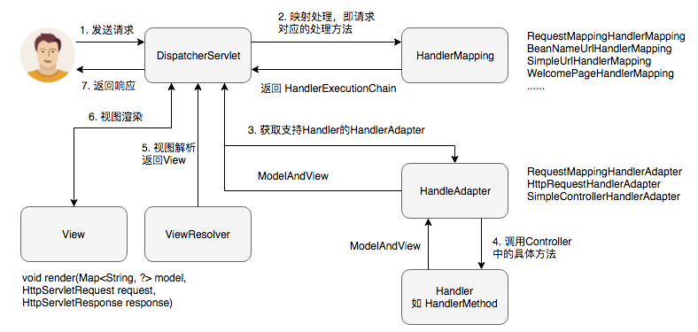

# 一、Spring MVC 流程

<div align="center">   </div><br>


1. 首先用户发送请求，`DispatcherServlet` 实现了 `Servlet`  接口，整个请求处理流：`HttpServlet.service -> FrameworkServlet.doGet -> FrameworkServlet.processRequest -> DispatcherServlet.doService -> DispatcherServlet.doDispatch`。 `doDispatch(HttpServletRequest request, HttpServletResponse response)` 方法即为整个 spring mvc 的处理流程。
2. 获取 url 请求对应的处理方法，遍历handlerMappings列表，获取对象`HandlerExecutionChain`(包含一个处理器 handler 如HandlerMethod 对象、多个 HandlerInterceptor 拦截器对象)。此处的handlerMappings列表为上下文中所有HandlerMapping接口的实现类（如图中列举了4个），遍历handlerMappings列表，针对每个handlerMapping试图获取HandlerExecutionChain，一旦成功（不为null），即返回。
3. 获取对应的 HandlerAdapter，HandlerAdapter 将会把2中的handler包装为适配器，从而支持多种类型的处理器，即适配器设计模式的应用，从而很容易支持很多类型的处理器。DispatcherServlet中的HandlerAdapter 列表如图中所列的3种，依次遍历，调用`HanderAdapter.supports`判断是否支持。
4. 调用Controller的具体方法处理请求，并返回一个 ModelAndView。HandlerAdapter会为每一个请求生成一个`ServletInvocableHandlerMethod`实例，核心方法`invokeAndHandle`，包括输入参数的处理和返回数据的解析。
5. 视图解析，遍历`DispatcherServlet`的ViewResolver列表，获取对应的View对象，入口方法`DispatcherServlet.processDispatchResult`。
6. 渲染，调用5中获取的View的render方法，完成对Model数据的渲染。此处的 Model 实际是一个 Map 数据结构。
7. DispatcherServlet 将6中渲染后的数据返回响应给用户，到此一个流程结束。

# 二、Spring MVC 九大组件

## HandlerMapping

根据 request 找到相应的处理器 Handler 和拦截器 Intecepter。

例如，标注 @RequestMapping 的每个 method 都可以看成是一个 Handler，由 Handler 来负责处理实际的请求。

## HandlerAdapter

因为 Spring MVC 中 Handler 可以是任意形式的，只要能够处理请求便行, 但是把请求交给 Servlet 的时候，由于Servlet 的方法结构都是如 `doService(HttpServletRequest req, HttpServletResponse resp) ` 这样的形式，让固定的 Servlet 处理方法调用 Handler 来进行处理，这一步工作便是 HandlerAdapter 要做的事。

## HandlerEceptionResolver

用来处理 Handler 过程中产生的异常情况的组件。 具体来说，此组件的作用是根据异常设置 ModelAndView, 之后再交给 render 方法进行渲染，而 render 便将 ModelAndView 渲染成页面。 

## ViewResolver

将 String 类型的视图名和 Locale 解析为 View 类型的视图。这个接口只有一个方法：

```java
View resolveViewName(String viewName, Locale locale) throws Exception;
```

## RequestToViewNameTranslator

从 Request 中获取 ViewName。因为 ViewResolver 是根据 ViewName 查找 View，但有的 Handler 处理完成之后，没有设置 View 也没有设置 ViewName， 便要通过这个组件来从 Request 中查找 ViewName.

## LocaleResolver

ViewResolver 的 `resolveViewName` 方法，需要两个参数。那么第二个参数 Locale 是从哪来的呢，这就是LocaleResolver 要做的事了。 LocaleResolver 用于从 request 中解析出 Locale，在中国大陆地区，Locale 当然就会是 zh-CN 之类，用来表示一个区域。这个类也是 i18n 的基础。

## ThemeResolver

这个类是用来解析主题的。主题，就是样式，图片以及它们所形成的显示效果的集合。Spring MVC 中一套主题对应一个 properties 文件，里面存放着跟当前主题相关的所有资源，如图片、css样式等。创建主题非常简单，只需准备好资源，然后新建一个 "主题名.properties" 并将资源设置进去，放在classpath下，便可以在页面中使用了。

## MultipartResource

用于处理上传请求，通过将普通的 Request 包装成 MultipartHttpServletRequest 来实现。

## FlashMapManager

FlashMapManager 就是用来管理 FlashMap 的。

# 三、时序图

<div align="center">   </div><br>

# 四、优化建议

1. Controller 如果能保持单例，尽量使用单例。
2. @RequestParam 给具体的参数和 url 中的参数进行一对一匹配。
3. Spring MVC 并没有对 url 和 Method 的对应关系进行缓存，建议自己对 url 和 Method 的关系进行缓存。

# 参考

[Spring MVC 流程解析](<https://segmentfault.com/a/1190000013816079>)