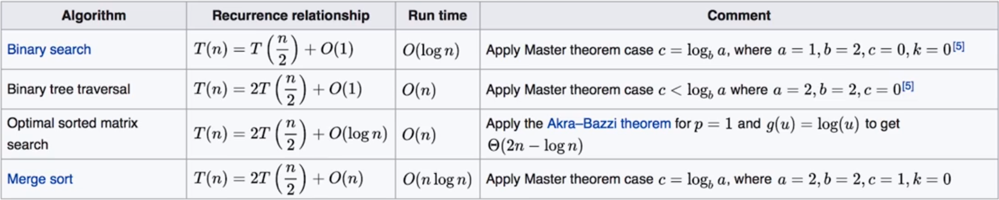

# 一、什么是算法复杂度？

算法进行计算的时候，存储数据需要占用一定的 **空间**，执行计算需要耗费一定的时间 **时间**。算法复杂度就是在算法计算过程中对「空间」与「时间」的评价。

解决同一个问题，不同算法所有的空间和时间是不同的，这取决于算法是如何设计的。同样，同一个问题，规模不同时，同一个算法所用的空间和时间也不同。

例如：某排序算法为 100 个数排序和为 1000 个数排序。

所以，一个算法的复杂度是问题规模 N 的函数。

# 二、时间复杂度

时间复杂度是算法执行计算所花费的时间多少的度量，但是不同的机器计算速度不同，实际的时间很难统计，由此可以通过统计算法执行的语句数来表示时间复杂度。

## 1. 渐进时间复杂度

随着问题规模 n 的增大，常数部分的影响越来越小：T(n) = **2**n^3 + **4**n + ​logn + **4**；而增长最快的项影响越来越大（n^3）：T(n) = 2**n^3** + 4n + ​logn + 4。

渐进时间复杂度只关注增长最快的项：T(n) = O(n^3)，去除常数系数与复杂度小的项。平时说代码的时间复杂度，一般指渐进时间复杂度。

n^n > n! > c^n > n^c > log(c)n > c，logn 一般表示 log(2)n。

## 2. 代码结构与渐进复杂度

分析代码复杂度时，可以按结构分析，再组合：

- 嵌套结构相乘：O(x) * O(y) = O(xy)
- 顺序结构相加：O(x) * O(y) = max(O(x),O(y))

## 3. 常见代码结构的时间复杂度

### Ⅰ. 常数次数

时间复杂度：O(1)

```java
int a = 10;
int b = a;
int N = 8;
```

### Ⅱ. 嵌套结构

循环次数 * 一次迭代次数，时间复杂度：O(N)

```java
for(int i = 0; i < N; i++){
  int a = 16 / 4;
  int b = a * 3;
}
```

### Ⅲ. 多重嵌套结构

各个循环次数相乘，时间复杂度：O(N^2)

```java
for(int i = 0; i < N; i++)
  for(int j = 0; j < N; j++){
    int a = 16 / 4;
    int b = a * 3;
  }
```

### Ⅳ. 顺序结构

各部分相加，时间复杂度：O(N^2)

```java
for(int i = 0; i < N; i++){
  int a = 16 / 4;
  int b = a * 3;
}
for(int i = 0; i < N; i++){
  int a = 16 / 4;
  int b = a * 3;
}
```

### Ⅴ. 循环次数

**除法次数**：N/2，时间复杂度：O(N)

```java
for(int i = 0; i < N; i = i + 2){}
```

**对数次数**：log(2)N，时间复杂度：O(logN)

```java
for(int i = N; i >= 0; i = i / 2){}
```

### Ⅵ. 递归

<div align="center">   </div><br>

# 三、空间复杂度

空间复杂度同样可以用 O() 来衡量，与时间复杂度分析类似，既要考虑算法处理的数据，也要考虑辅助变量。

算法分析的过程中更多关注时间复杂度。