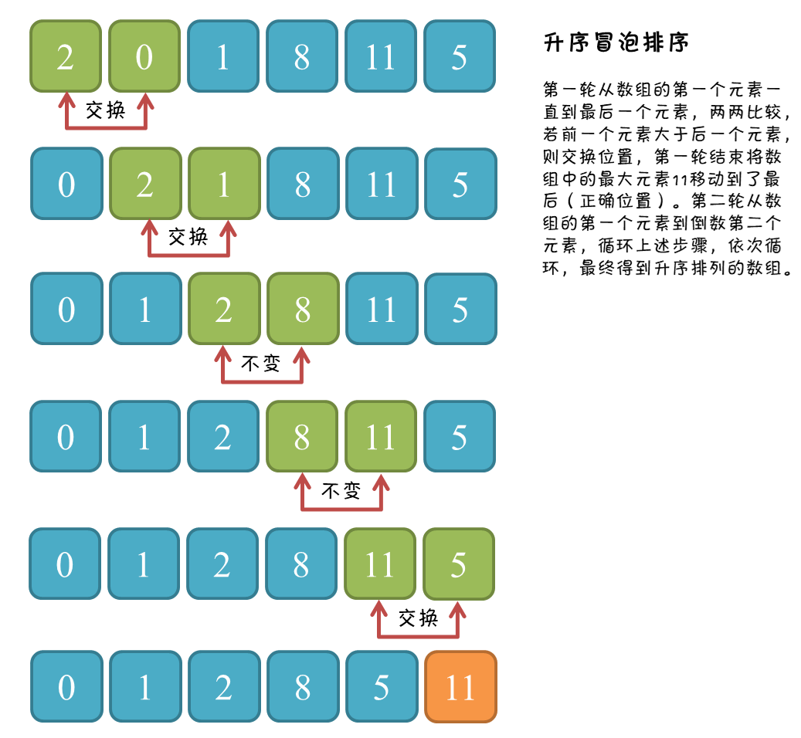

# 一、思想

**每轮冒泡（循环）把最小/大的数放在最后。**

对相邻的元素进行两两比较，顺序相反则进行交换，这样，每一趟都会将最小或最大的元素交换的顶端，最终达到完全有序，例如，升序排列，就是最大的元素移动后面的过程。

# 二、图解过程

<div align="center">   </div><br>

冒泡排序升序排列的整个过程如下图，数组共包含 6 个元素，第一轮将 6 个元素中最大的元素「11」交换至数组的最后；第二轮将剩下 5 个元素中的最大元素「8」交换至「11」的前面。依次执行，直到所有的元素比较完成。总的来说，冒泡排序升序排列就是不断将最大的元素移动到后面的过程。

<div align="center">   </div><br>

# 三、核心代码

```java
public static void bubbleSort(int[] arr){
  
    if(arr == null || arr.length < 2) return;
  
    for(int e = arr.length - 1; e > 0; e--){
        for(int i = 0; i < e; i++){
            if(arr[i] > arr[i + 1]){
                swap(arr, i, i + 1);
}}}}
```

从上面的动图可以看出，当将最大的两个元素交换到正确位置时，前面的4个元素已经排序完成，为了减少不必要的比较，可以增加一个标志位，判断排序的结果，只要有一个轮次没有发生交换，表示数组已经排序完成，不再执行下面的轮次。

# 四、算法分析

## 1. 时间复杂度

若数组为倒序，即所有的轮次都必须执行完（最坏情况），比较次数为 `n-1 + n-2 +...+ 1 = n(n-1)/2`，交换次数与比较次数相同，所以时间复杂度为$O(N^2)$。

## 2. 额外空间复杂度

未借助其它辅助空间，O(1)。

## 3. 稳定性

冒泡排序每次都比较相邻的元素，只有前者比后者大才交换位置，相同大小的数，原本在前面，不可能「冒」到另一个后面。

所以，冒泡排序是一种稳定的排序方法。