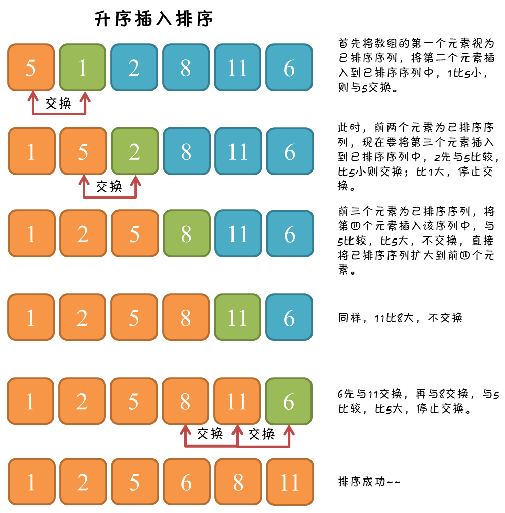

# 一、思想

**维护一个有序列，不停把新元素插入其中。**

插入排序的工作方式像许多人排序一手扑克牌，开始时，我们的左手为空并且桌子上的牌面朝下。然后，我们每次从桌子上拿走一张牌并将它插入左手中正确的的位置，从右到左将它与已在手中的每张牌进行比较，选择正确位置进行插入，这样，当桌子上的牌全部插入到手中，手中的扑克牌则是所有扑克牌的已排序状态。

# 二、图解过程

<div align="center">   </div><br>

# 三、核心代码

```java
public static void insertionSort(int[] arr){
  
    if(arr == null || arr.length < 2) return;
  
    for(int i = 1; i < arr.length; i++){
        for(int j = i - 1; j >= 0 && arr[j] > arr[j + 1]; j--){
            swap(arr, j, j + 1);
    }
  }
}
```

# 四、算法分析

## 1. 时间复杂度

最坏的情况是待排序数组完全逆序，也就是每一次插入都要和有序集合中的所有元素进行比较，插入第二个元素时需要与前 1 个元素进行比较，插入第 3 个元素时，需要与前 2 个元素比较，以此类推，插入前 N 个元素需要与前 N-1 个元素比较。`1 + 2 + 3 + ... + (N-1)`，结果为 (N-1)*N/2，即 O(N^2)。

最好的情况是待排序数组已经是有序的了，每插入一个元素只需要和前一个元素进行比较，复杂度为 O(N)。

## 2. 额外空间复杂度

未借助其它辅助空间，O(1)。

## 3. 稳定性

插入排序是从前向后依次选择目标向前插入，向前插入时，遇到相同的数，插在相同的数后边。

所以，插入排序是稳定的排序算法。