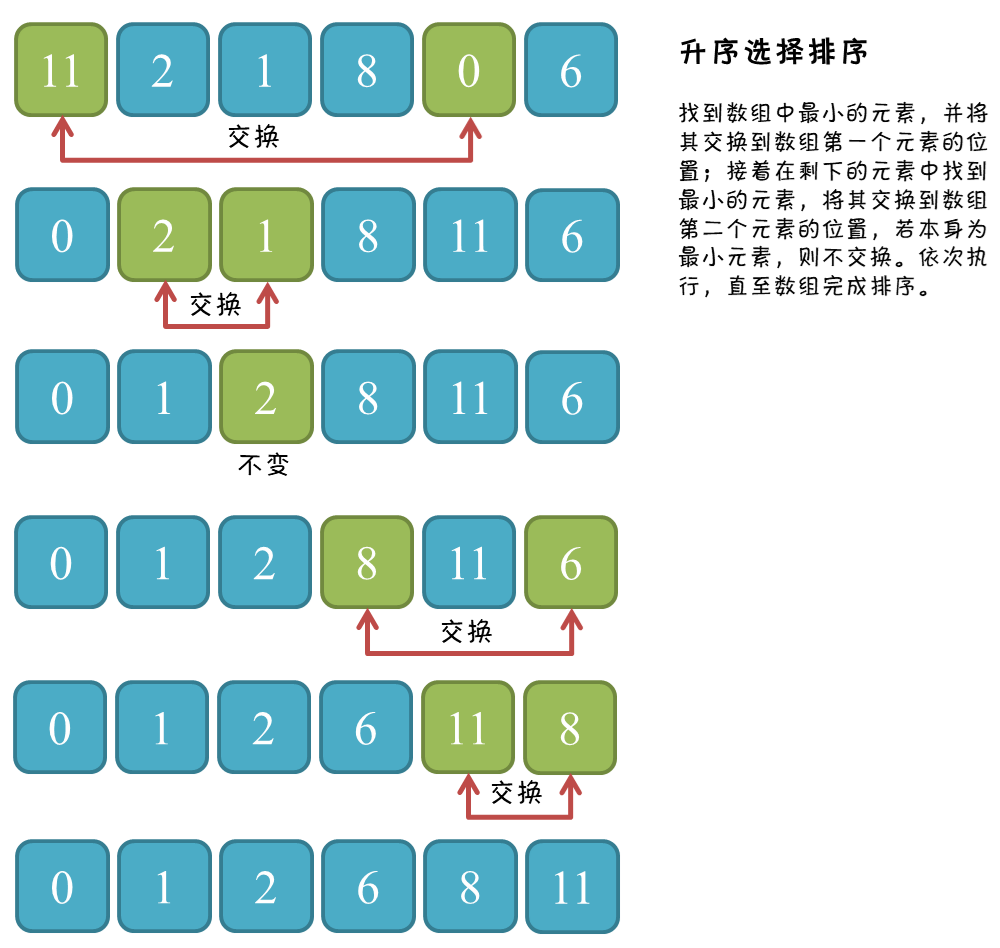

# 一、思想

**将最 小/大 的数交换到待排序序列的最前面。**

首先，找到数组中最小的那个元素，其次，将它和数组的第一个元素交换位置（如果第一个元素就是最小元素那么就和自己交换）。在剩下的元素中找到最小的元素，将它与数组的第二个元素交换位置。如此往复，直到将整个数组排序。这种方法叫做选择排序，因为它在不断地选择剩余元素之中的最小者。

# 二、图解过程

<div align="center">   </div><br>

# 三、核心代码

```java
public static void selectionSort(int[] arr) {
  
    if (arr == null || arr.length < 2) return;
  
    for (int i = 0; i < arr.length - 1; i++) {
        int minIndex = i；//寻找当前循环最小元素的下标
        for (int j = i + 1; j < arr.length; j++) {
            minIndex = arr[j] < arr[minIndex] ? j : minIndex;
        }
        swap(arr, i, minIndex);
    }
}
```

# 四、 算法分析

## 1. 时间复杂度

若待排序的元素总数为 N，外层循环 N 次（本文代码简写外层循环 N-1 次，不影响复杂度分析），第一次内循环比较 N-1 次（与除了本身的所有元素进行比较，找出最值），第二次内循环比较 N-2 次，以此类推，最后一次内循环比较 1 次，总共比较 (N-1) + (N-2) + ... + 1 次，等差求和，再乘上外层循环次数，共循环 N(N-1)/2 次，每次进行常数次的比较、赋值操作，时间复杂度为 $O(N^2)$。

## 2. 额外空间复杂度

未借助其它辅助空间，$O(1)$。

## 3. 稳定性

排序算法的稳定性：假设有两个相同大小的数，排序后能否维持排序前的顺序不变呢？若能维持，则说明是稳定的排序。

假设排序：5，8，5，2，9，第一次选择排序后第一个 5 与 2 交换，变为：2，8，5，5，9，第一个 5 交换到了另一个 5 的后边。

所以，选择排序不是稳定排序。