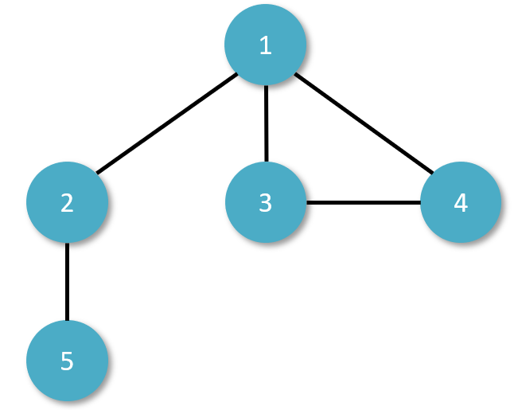
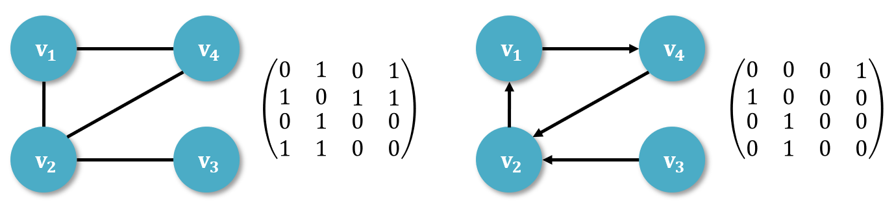
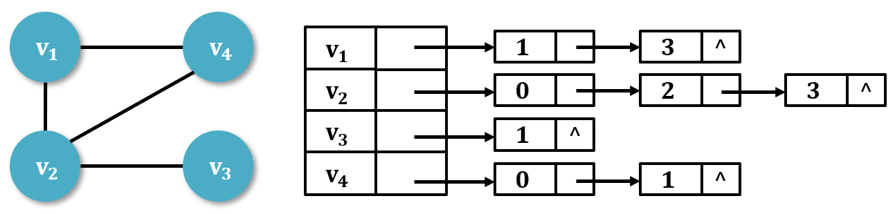

# 一、什么是图？

图是一种比树结构更复杂的非线性结构。在图结构中，任意两个结点之间都可能相关，即结点之间的邻接关系可以是任意的。因此，图结构被用于描述各种复杂度的数据对象，在自然科学、社会科学和人文科学等许多领域有着非常广泛的应用。

图由一个顶点集合 V 和一条边(或者弧)集合 E 组成，通常记为 G = (V, E)。

<div align="center">   </div><br>

# 二、相关术语

## 1. 无向图

在一个图中，如果任意两个顶点构成的偶对是无序的，即顶点之间的连线是没有方向的，则称该图为无向图。

## 2. 有向图

在一个图中，如果两个顶点之间的边是有方向的，即构成的偶对是有序的，则称该图为有向图。

## 3. 邻接点、邻接边

若 vi 和 vj 之间有边，互相称之为邻接点，(vi, vj) 称为 vi 和 vj 的邻接边。

## 4. 完全图

在无向图中，如果任意两顶点都有一条边直接连接，则称该图为无向完全图。含有 n 个顶点的无向完全图有 n(n-1)/2 条边，因为每条边都被计算了两次，结点 A 到结点 B 和 结点 B 到结点 A，所以除以 2。

在有向图中，如果任意两顶点之间都有方向互为相反的两条弧相连接，则称该图为有向完全图。含有 n 个顶点的有向完全图有 n(n-1) 条边。

## 5. 稠密图、稀疏图

若一个图完全接近完全图，成为稠密图；反之，边数很少的图成为稀疏图。

## 6. 顶点的度、入度、出度

顶点的度是指依附于某顶点 v 的边数，通常记为 TD(v)。

有向图中，顶点 v 的入度是指以顶点 v 为终点的弧的数目，记为 ID(v)；出度是指以顶点 v 为初始的弧的数目，记为 OD(v)。

## 7. 边的权、网图

与边有关的数据信息称为权。

边上带权的图称为带权图或网图或网络。

## 8. 回路、简单路径、简单回路

若一条轮径的起始点与终点时同一个点，则该路径为回路或环。

若路径中的顶点不重复出现，则称该路径为简单路径。

除第一个顶点与最后一个顶点外，其他顶点不重复出现的回路称为简单回路。

## 9. 子图

对于图 G=(V, E)，若存在 V' 是 V 的子集， E' 是 E 的子集，且 E' 中的边都依附于 V' 中的点，则称图 G' = (V', E') 是 G 的一个子图。

## 10. 连通的、连通图、连通分量

在无向图中，如果从一个顶点 vi 到另一个顶点 vj 有路径，则称顶点 vi 和 vj 是连通的。

如果图中任意两个顶点都是连通的，则称该图是连通图。

无向图的极大连通子图成为连通分量。对于连通图而言，连通分量就是它本身。

## 11. 强连通图、强连通分量

对于有向图而言，若图中任意一对顶点 vi 和 vj 之间，既有从 vi 到 vj 的路径，也有从 vj 到 vi 的路径，则称该有向图是强连通图。

有向图的极大强连通子图成为强连通分量。

## 12. 连通图的生成树

连通图 G 的生成树，是包含 G 的全部 n 个顶点的一个极小连通子图，它必定包含且仅包含 G 的 n-1 条边。

# 三、图的存储

一个图的信息包括两部分，即图中顶点的信息以及描述顶点之间的关系——边或弧的信息。因此，无论采用什么方法建立图的存储结构，都要完整、准确的反应这两方面的信息。

## 1. 邻接矩阵

对于图中的 n 个顶点采用顺序存储，任意两个顶点之间是否有邻接关系，即是否有边，则用一个 n×n 的矩阵表示。有边为 1，无边为 0。

<div align="center">   </div><br>

## 2. 邻接表

邻接矩阵是图的顺序存储方法，邻接表是图的顺序存储与链式存结合的存储方法。

每一条边用一个结点存储，把某个顶点 vi 的所有邻接边链接成一个单链表，将该单链表的头位置和这个顶点的信息作为顶点结点依次顺序存储起来，就构成了图的邻接表。

<div align="center">   </div><br>

## 3. 代码实现

### Ⅰ. 结点

```java
public class Node {
    public int value;
    public int in;
    public int out;
    public ArrayList<Node> nexts;
    public ArrayList<Edge> edges;

    public Node(int value) {
        this.value = value;
        in = 0;
        out = 0;
        nexts = new ArrayList<>();
        edges = new ArrayList<>();
    }
}
```

### Ⅱ. 边

```java
public class Edge {
    public int weight;
    public Node from;
    public Node to;

    public Edge(int weight, Node from, Node to) {
        this.weight = weight;
        this.from = from;
        this.to = to;
    }
}
```

### Ⅲ. 图

```java
public class Graph {
    public HashMap<Integer,Node> nodes;
    public HashSet<Edge> edges;

    public Graph() {
        nodes = new HashMap<>();
        edges = new HashSet<>();
    }
}
```

# 四、图的遍历

## 1. 深度优先搜索

假设初始状态是图中所有顶点未曾被访问，则深度优先搜索可以从图中某个顶点 v 出发，访问此顶点，然后依次从 v 的未被访问的邻接点出发深度优先遍历该图，直至图中所有和 v 有路径的顶点都被访问到；若此时图中尚有顶点未被访问，则另选图中一个未曾被访问的顶点作起始点，重复上述过程，直至图中所有顶点都被访问到为止。

```java
public static void dfs(Node node) {
    if (node == null) return;

    Stack<Node> stack = new Stack<>();
    HashSet<Node> set = new HashSet<>();
    stack.add(node);
    set.add(node);
    System.out.println(node.value);

    while (!stack.isEmpty()) {
        Node cur = stack.pop();
        for (Node next : cur.nexts) {
            if (!set.contains(next)) {
                stack.push(cur);
                stack.push(next);
                set.add(next);
                System.out.println(next.value);
                break;
            }
        }
    }
}
```

## 2. 广度优先搜索

假设从图中某顶点 v 出发，在访问了 v 之后，依次访问 v 的各个未曾访问过的顶点，然后按照访问的顺序，再分别从这些邻接点出发依次访问他们的邻接点，并使「先被访问的顶点的邻接点」先于「后被访问的顶点的邻接点」被访问，直至图中所有已被访问的顶点的邻接点都被访问到。若此时图中尚有顶点未被访问，则另选图中一个未被访问的顶点作起始点。重复上述过程，直至图中所有顶点都被访问到为止。

```java
public static void bfs(Node node) {
    if (node == null) return;

    Queue<Node> queue = new LinkedList<>();
    HashSet<Node> map = new HashSet<>();
    queue.add(node);
    map.add(node);

    while (!queue.isEmpty()) {
        Node cur = queue.poll();
        System.out.println(cur.value);
        for (Node next : cur.nexts) {
            if (!map.contains(next)) {
                map.add(next);
                queue.add(next);
            }
        }
    }
}
```

# 五、拓扑排序

**有向无环图** (Directed Acycline Graph, DAG 图)正如字面意思一样，是一个无环的有向图。

**AOV 网** (Activity on Vertex Network)，若以图中的顶点来表示活动，有向边表示活动之间的优先关系，则这样活动在顶点上的有向图成为 AOV 网。

拓扑排序是指给定一幅有向图，将所有的顶点排序，使得所有的有向边均从排在前面的元素指向排在后面的元素。当且仅当一幅有向图是无环图图时才能进行拓扑排序。

算法步骤：

1. 从图中选择一个没有前驱的顶点(该顶点的入度为 0)，将其输出到拓扑序列中。
2. 从图中删除该顶点，并且删除从该顶点出发的全部有向边。
3. 重复上述两步，直到剩余的图中不再存在没有前驱的顶点为止。

这样操作的结果有两种：一种是图中全部顶点都被输出，这说明网中不存在有向回路；另一种就是图中顶点未被全部输出，剩余的顶点均存在前驱顶点，这说明图中存在有向回路。

```java
public static List<Node> sortedTopology(Graph graph) {
    HashMap<Node, Integer> inMap = new HashMap<>();
    Queue<Node> zeroInQueue = new LinkedList<>();
    for (Node node : graph.nodes.values()) {
        inMap.put(node, node.in);
        if (node.in == 0) {
            zeroInQueue.add(node);
        }
    }
    List<Node> result = new ArrayList<>();
    while (!zeroInQueue.isEmpty()) {
        Node cur = zeroInQueue.poll();
        result.add(cur);
        for (Node next : cur.nexts) {
            inMap.put(next, inMap.get(next) - 1);
            if (inMap.get(next) == 0) {
                zeroInQueue.add(next);
            }
        }
    }
    return result;
}
```

# 六、最小生成树

加权图是一种为每条边关联一个权值或者成本的图模型。这种图能够自然地表示许多应用，在一幅航空图中，边表示航线，权值则可以表示距离或是费用。类似这些的场景中，最令人感兴趣的自然是将成本最小化。

图的生成树是它的一棵含有其所有顶点的无环连通子图。一幅加权无向图的最小生成树是它的一棵权值(树中所有边的权值之和)最小的生成树。

## 1. Prim 算法

该算法每一步都会为一棵生长中的树添加一条边。一开始这棵树只有一个顶点，然后会向它添加 V-1 条边，每次总是将下一条连接树中的顶点与不在树中的顶点且权重最小的边加入树中。

```java
// 升序比较器
public static class EdgeComparator implements Comparator<Edge> {
    @Override
    public int compare(Edge o1, Edge o2) {
        return o1.weight - o2.weight;
    }
}

public static Set<Edge> primMST(Graph graph) {

    // 边权值升序的优先级队列，存储与当前生成树关联的边
    PriorityQueue<Edge> priorityQueue = new PriorityQueue<>(new EdgeComparator());
    // 生成树中的结点
    HashSet<Node> set = new HashSet<>();
    // 生成树中的边
    Set<Edge> result = new HashSet<>();
    // 遍历图中所有结点
    for (Node node : graph.nodes.values()) {
        // 若结点不在生成树中，则将结点加入树，并结点关联的边加入优先级队列
        if (!set.contains(node)) {
            set.add(node);
            for (Edge edge : node.edges) {
                priorityQueue.add(edge);
            }
            while (!priorityQueue.isEmpty()) {
                Edge edge = priorityQueue.poll();
                Node toNode = edge.to;
                if (!set.contains(toNode)) {
                  set.add(toNode);
                  result.add(edge);
                  for (Edge nextEdge : toNode.edges) {
                    priorityQueue.add(nextEdge);
                  }
                }
            }
        }
    }
    return result;
}
```

## 2. Kruskal 算法

依次将图中权重最小的边加入最小生成树中，加入的边不会与已经加入的边构成环，直到树中含有 V-1 条边为止。

```java
    
public static class UnionFind {
    private HashMap<Node, Node> fatherMap;
    private HashMap<Node, Integer> rankMap;

    public UnionFind() {
        fatherMap = new HashMap<Node, Node>();
        rankMap = new HashMap<Node, Integer>();
    }

    private Node findFather(Node n) {
        Node father = fatherMap.get(n);
        if (father != n) {
            father = findFather(father);
        }
        fatherMap.put(n, father);
        return father;
    }

    public void makeSets(Collection<Node> nodes) {
        fatherMap.clear();
        rankMap.clear();
        for (Node node : nodes) {
            fatherMap.put(node, node);
            rankMap.put(node, 1);
        }
    }

    public boolean isSameSet(Node a, Node b) {
        return findFather(a) == findFather(b);
    }

    public void union(Node a, Node b) {
        if (a == null || b == null) {
            return;
        }
        Node aFather = findFather(a);
        Node bFather = findFather(b);
        if (aFather != bFather) {
            int aFrank = rankMap.get(aFather);
            int bFrank = rankMap.get(bFather);
            if (aFrank <= bFrank) {
                fatherMap.put(aFather, bFather);
                rankMap.put(bFather, aFrank + bFrank);
            } else {
                fatherMap.put(bFather, aFather);
                rankMap.put(aFather, aFrank + bFrank);
            }
        }
    }
}
// 升序比较器
public static class EdgeComparator implements Comparator<Edge> {
    @Override
    public int compare(Edge o1, Edge o2) {
        return o1.weight - o2.weight;
    }
}

public static Set<Edge> kruskalMST(Graph graph) {
    UnionFind unionFind = new UnionFind();
    unionFind.makeSets(graph.nodes.values());
    PriorityQueue<Edge> priorityQueue = new PriorityQueue<>(new EdgeComparator());
    for (Edge edge : graph.edges) {
        priorityQueue.add(edge);
    }
    Set<Edge> result = new HashSet<>();
    while (!priorityQueue.isEmpty()) {
        Edge edge = priorityQueue.poll();
        if (!unionFind.isSameSet(edge.from, edge.to)) {
            result.add(edge);
            unionFind.union(edge.from, edge.to);
        }
    }
    return result;
}
```

