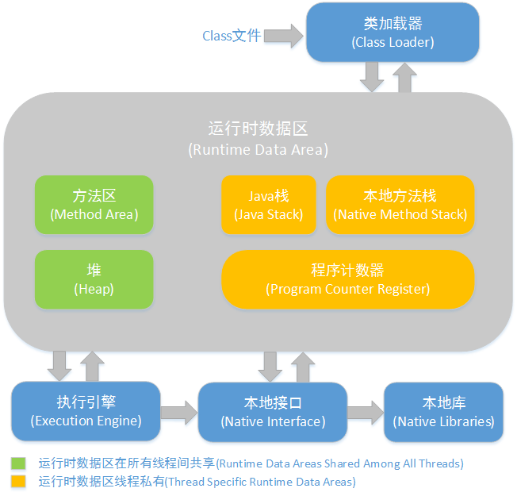
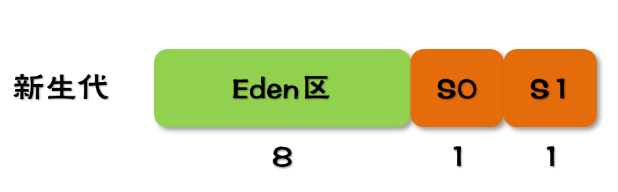
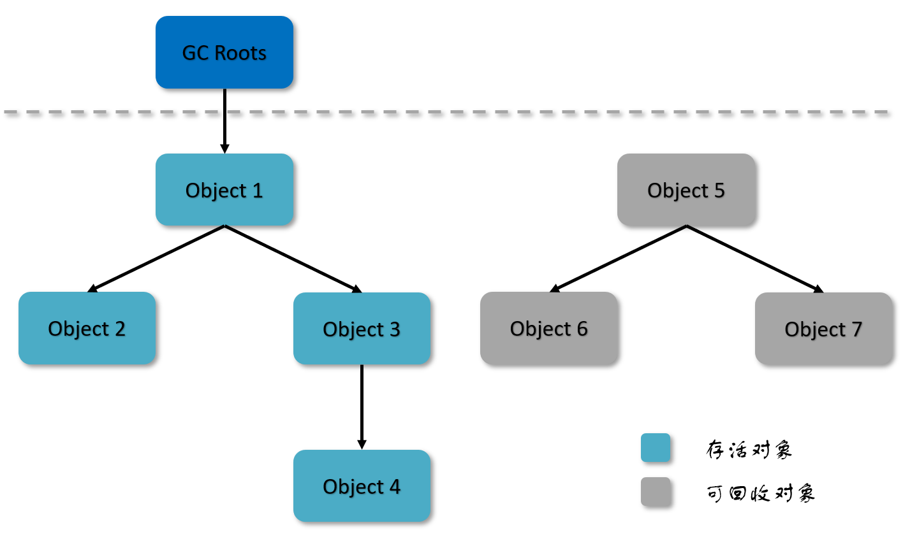
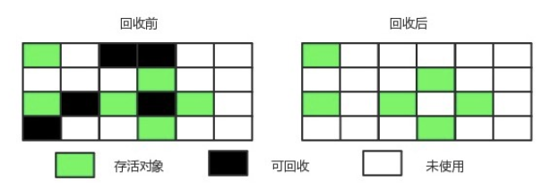
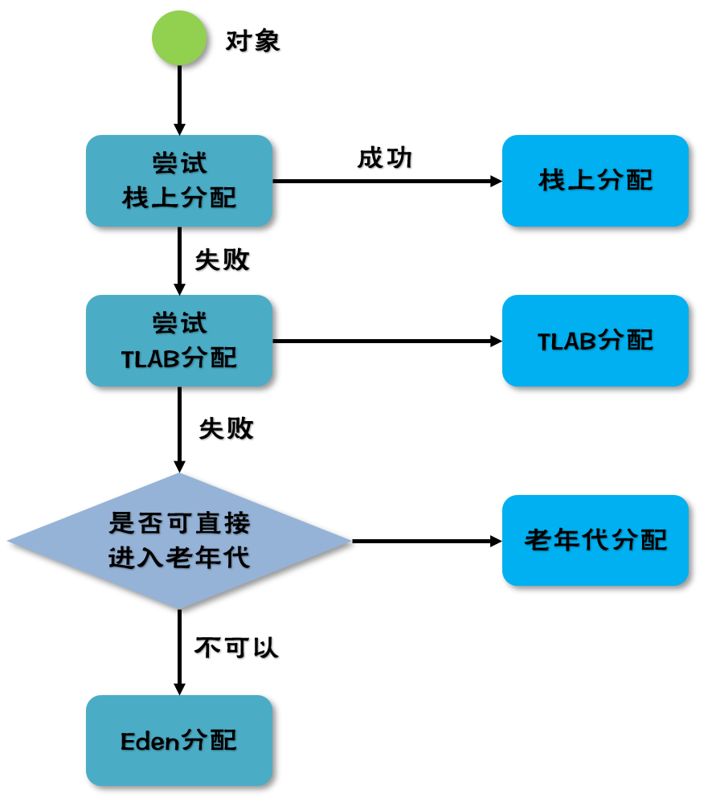

[TOC]

# 引言

Java 有一个口号是 "wirte once run everywhere"，这一功能实现的基础就是 Java 虚拟机（JVM）。JVM 有两个功能：1. 将软件层面上的代码转换成机器可读的二进制机器码 2. 内存管理。

**为什么要学习 JVM？**

对于 C/C++ 来讲，程序拥有每一个对象的「所有权」，又担负着每一个对象声明开始到终结的维护责任；而对于 Java 来讲，在虚拟机自动内存管理机制的帮助下，不再需要为每一个 new 操作去写配对的 delete/free 代码，不容易出现内存泄漏和内存溢出问题，这对于 Java 开发人员来说是一件十分美好的事情，但是，任何事都有两面性，一旦出现内存泄漏和溢出方面的问题，如果不了解虚拟机是怎样使用内存的，那么排查错误将会是一件十分困难的事情。所以，对于一名高级 Java 工程师来说，掌握 JVM 是至关重要的。

# 一、运行时数据区域

写出来的代码只有运行起来才有价值，JVM 在执行 Java 程序的过程中会把它所管理的内存划分为若干个不同的数据区域。

<div align="center">   </div><br>

## 1.1 程序计数器

【线程私有】指向当前线程所执行的字节码的地址/行号。

**有没有思考过，既然当前已经在运行了，为什么还要把地址记录下来呢？**

回到计算机底层去分析这一问题，线程是在 CPU 上执行的，而 CPU 是使用时间片算法运行的，也就是说线程在任何时刻都可能被挂起，为了线程切换后能恢复到正确的执行位置，就需要在程序计数器中记录当前线程所执行的字节码地址，每条线程都需要一个独立的程序计数器，各条线程之间计数器互不影响。

此内存区域时唯一一个在 JVM 规范中没有规定任何 OutofMemoryError 情况的区域。

## 1.2 Java 虚拟机栈

【线程私有】存储当前线程运行方法所需要的数据、指令和返回地址。

虚拟机栈描述的是 Java 方法执行的内存模型：每个方法在执行的同时都会创建一个 **栈帧** 用于存储 **局部变量表**、**操作数栈**、**动态链接**、**方法出口** 等信息。每一个方法从调用直至执行完成的过程，就对应着一个栈帧在虚拟机中入栈到出栈的过程。

局部变量表存储局部变量，编译器就已经知道大小的区块，局部变量的空间（Slot）是定长的（32 位），其中 64 位长度的 long 和 double 类型的数据占用两个局部变量空间；若局部变量为引用类型，则存储地址，指向堆中的对象。

该区域可能抛出以下异常：

* StackOverflowError 异常：线程请求的栈深度大于虚拟机所允许的深度。

* OutOfMemoryError 异常：栈进行动态扩展时无法申请到足够的内存。

## 1.3 本地方法栈

【线程私有】本地方法栈与 Java 虚拟机栈类似，区别就是本地方法栈为本地（Native）方法服务。

本地方法一般是使用其它语言（C/C++或汇编等）编写的，并且被编译为基于本机硬件和操作系统的程序。

## 1.4 堆

【线程共享】所有对象都在这里分配内存区域，是垃圾收集的主要区域（GC 堆）。

现代的垃圾收集器基本都是采用分代收集算法（因为对象的生命周期不同），主要的思想是针对不同类型的对象采取不同的垃圾回收算法。可以将堆分为：

* 新生代（Young Generation）

  新生代分为三个区：一个 Eden 区，两个 Survivor 区。

<div align="center">   </div><br>

* 老年代（Old Generation）

Java 堆不需要连续内存，并且可以动态增加其内存，增加失败会抛出 OutOfMemoryError 异常。

可以通过 -Xms 和 -Xmx 两个虚拟机参数来指定一个程序的 Java 堆内存大小，第一个参数设置初始值，第二个参数设置最大值。

```
java -Xms=1M -Xmx=2M HackTheJava
```

## 1.5 方法区

【线程共享】存储已被虚拟机加载的类信息、常量、静态变量、即时编译器（JIT）编译后的代码等数据。

和堆一样不需要连续的内存，并且可以动态扩展，动态扩展失败一样会抛出 OutOfMemoryError 异常。

对这块区域进行垃圾回收的主要目标是对常量池的回收和对类的卸载，但是一般比较难实现。

JDK 1.7 之前，HotSpot 虚拟机把它当成永久代来进行垃圾回收，JDK 1.8 之后，取消了永久代，用 Meta Space（元数据）区替代。

## 1.6 运行时常量

运行时常量池是方法区的一部分。

Class 文件中的常量池（编译器生成的各种字面量和符号引用）会在类加载后被放入这个区域。

除了在编译期生成的常量，还允许动态生成，例如 String 类的 intern()。

## 1.7 直接内存

直接内存并不是虚拟机运行时数据区的一部分，也不是虚拟机规范中定义的内存区域，但是这部分内存也被频繁地使用。而且也可能导致 OutOfMemoryError 异常出现。

JDK1.4 中新加入的 NIO 类，引入了一种基于通道（Channel）与缓存区（Buffer） 的 I/O 方式，它可以直接使用 Native 函数库直接分配堆外内存，然后通过一个存储在 Java 堆中的 DirectByteBuffer 对象作为这块内存的引用进行操作。这样就能在一些场景中显著提高性能，因为避免了在堆和 Native 堆之间来回复制数据。

# 二、垃圾收集

垃圾收集主要是针对堆和方法区进行。

程序计数器、虚拟机栈和本地方法栈这三个区域属于线程私有的，只存在于线程的生命周期内，线程结束之后也会消失，因此不需要对这三个区域进行垃圾回收。

## 2.1 判断一个对象是否可被回收

### 2.1.1 引用计数算法

为对象添加一个引用计数器，每当有一个地方引用它，计数器就加 1；当引用失效，计数器就减 1。引用计数为 0 的对象可被回收。

在两个对象出现 **循环引用** 的情况下，引用计数器永远不为 0，导致无法对他们进行回收。正因为循环引用的存在，Java 虚拟机不使用引用计数算法。

### 2.1.2 可达性分析算法

将 GC Roots 作为起始点进行搜索，可达的对象都是存活的，不可达的对象可被回收。

Java 虚拟机使用该算法来判断对象是否可被回收，在 Java 中 GC Roots 一般包含以下内容：

- 虚拟机栈（栈帧中的局部变量表）中引用的对象
- 本地方法栈中 JNI（Native方法）中引用的对象
- 方法区中静态属性引用的对象
- 方法区中常量引用的对象


<div align="center">   </div><br>

### 2.1.3 引用类型

无论是通过引用计数算法判断对象的引用数量，还是通过可达性分析算法判断对象是否可达，判定对象是否可被回收都与引用有关。

Java 提供了四种强度不同的引用类型，引用强度依次减弱。

#### 1. 强引用

被强引用关联的对象不会被回收。

使用 new 一个新对象的方式来创建强引用。

```java
Object obj = new Object();
```

#### 2. 软引用

被软引用关联的对象只有在内存不够的情况下才会被回收。

使用 SoftReference 类来创建软引用。

```java
Object obj = new Object();
SoftReference<Object> sf = new SoftReference<Object>(obj);
obj = null;  // 使对象只被软引用关联
```

#### 3. 弱引用

被弱引用关联的对象一定会被回收，也就是说它只能存活到下一次垃圾回收发生之前。

使用 WeakReference 类来创建弱引用。

```java
Object obj = new Object();
WeakReference<Object> wf = new WeakReference<Object>(obj);
obj = null;
```

#### 4. 虚引用

又称为幽灵引用或者幻影引用，一个对象是否有虚引用的存在，不会对其生存时间造成影响，也无法通过虚引用得到一个对象。

为一个对象设置虚引用的唯一目的是能在这个对象被回收时收到一个系统通知。

使用 PhantomReference 来创建虚引用。

```java
Object obj = new Object();
PhantomReference<Object> pf = new PhantomReference<Object>(obj);
obj = null;
```

### 2.1.4 方法区的回收

Java 虚拟机规范中确实说过可以不要求虚拟机在方法区实现垃圾收集，而且在方法区中进行垃圾收集的 「性价比」一般比较低：在堆中，尤其在新生代中，常规的应用一次垃圾收集一般可以回收 70% ~ 95%的空间，而永久代的垃圾收集效率远低于此。

永久代的垃圾收集主要回收两部分：**废弃常量** 和 **无用的类**。

判定一个常量是否是「废弃常量」比较简单，而要判定一个类是否是「无用的类」的条件则相对苛刻许多。类需要同时满足下面 3 个条件才能算是「无用的类」 ：

- 该类所有的实例都已经被回收，Java 堆中不存在该类的任何实例。
- 加载该类的 ClassLoader 已经被回收。
- 该类对应的 java.lang.Class 对象没有任何地方被引用，无法在任何地方通过反射访问该类的方法。

满足上述 3 个条件也不一定被回收。

### 2.1.5 finalize()

类似 C++ 的析构函数，用于关闭外部资源。但是 try-finally 等方式可以做得更好，并且该方法运行代价很高，不确定性大，无法保证各个对象的调用顺序，因此最好不要使用。

即使在可达性分析法中不可达的对象，也并非是「非死不可」的，这时候它们暂时处于「缓刑阶段」，要真正宣告一个对象死亡，至少要经历两次标记过程。可达性分析法中不可达的对象被第一次标记并且进行一次筛选，筛选的条件是此对象是否有必要执行 finalize 方法。当对象没有覆盖 finalize  方法，或 finalize 方法已经被虚拟机调用过时，虚拟机将这两种情况视为没有必要执行。被判定为需要执行的对象将会被放在一个队列中进行第二次标记，除非这个对象与引用链上的任何一个对象建立关联，否则就会被真的回收。

## 2.2 垃圾收集算法

### 2.2.1 标记 - 清除

<div align="center">   </div><br>

标记要回收的对象，然后清除。

不足：

- 标记和清除过程效率都不高；
- 会产生大量不连续的内存碎片，导致无法给大对象分配内存。

### 2.2.2 标记 - 整理

<div align="center">   </div><br>

让所有存活的对象都向一端移动，然后直接清理掉端边界以外的内存。

### 2.2.3 复制

<div align="center">   </div><br>

将内存划分为大小相等的两块，每次只使用其中一块，当这一块内存用完了就将还存活的对象复制到另一块上面，然后再把使用过的内存空间进行一次清理。

主要不足是只使用了内存的一半。

现在的商业虚拟机都采用这种收集算法回收新生代，但是并不是划分为大小相等的两块，而是一块较大的 Eden 空间和两块较小的 Survivor 空间，每次使用 Eden 和其中一块 Survivor。在回收时，将 Eden 和 Survivor 中还存活着的对象全部复制到另一块 Survivor 上，最后清理 Eden 和使用过的那一块 Survivor。

HotSpot 虚拟机的 Eden 和 Survivor 大小比例默认为 8:1，保证了内存的利用率达到 90%。如果每次回收有多于 10% 的对象存活，那么一块 Survivor 就不够用了，此时需要依赖于老年代进行空间分配担保，也就是借用老年代的空间存储放不下的对象。

### 2.2.4 分代收集

现在的商业虚拟机采用分代收集算法，它根据对象存活周期将内存划分为几块，不同块采用适当的收集算法。

一般将堆分为新生代和老年代。

- 新生代使用：复制算法
- 老年代使用：标记 - 清除 或者 标记 - 整理 算法

## 2.3 垃圾收集器

<div align="center">   </div><br>

以上是 HotSpot 虚拟机中的 7 个垃圾收集器，连线表示垃圾收集器可以配合使用。

- 单线程与多线程：单线程指的是垃圾收集器只使用一个线程进行收集，而多线程使用多个线程；
- 串行与并行：串行指的是垃圾收集器与用户程序交替执行，这意味着在执行垃圾收集的时候需要停顿用户程序；并形指的是垃圾收集器和用户程序同时执行。除了 CMS 和 G1 之外，其它垃圾收集器都是以串行的方式执行。

### 2.3.1 Serial 收集器

<div align="center">   </div><br>

Serial 翻译为串行，也就是说它以串行的方式执行。

它是单线程的收集器，只会使用一个线程进行垃圾收集工作。

它的优点是简单高效，在单个 CPU 环境下，由于没有线程交互的开销，因此拥有最高的单线程收集效率。

它是 Client 场景下的默认新生代收集器，因为在该场景下内存一般来说不会很大。它收集一两百兆垃圾的停顿时间可以控制在一百多毫秒以内，只要不是太频繁，这点停顿时间是可以接受的。

### 2.3.2 ParNew 收集器

<div align="center">   </div><br>

它是 Serial 收集器的多线程版本。

它是 Server 场景下默认的新生代收集器，除了性能原因外，主要是因为除了 Serial 收集器，只有它能与 CMS 收集器配合使用。

### 2.3.3 Parallel Scavenge 收集器

与 ParNew 一样是多线程收集器。

其它收集器目标是尽可能缩短垃圾收集时用户线程的停顿时间，而它的目标是达到一个可控制的吞吐量，因此它被称为“吞吐量优先”收集器。这里的吞吐量指 CPU 用于运行用户程序的时间占总时间的比值。

停顿时间越短就越适合需要与用户交互的程序，良好的响应速度能提升用户体验。而高吞吐量则可以高效率地利用 CPU 时间，尽快完成程序的运算任务，适合在后台运算而不需要太多交互的任务。

缩短停顿时间是以牺牲吞吐量和新生代空间来换取的：新生代空间变小，垃圾回收变得频繁，导致吞吐量下降。

可以通过一个开关参数打开 GC 自适应的调节策略（GC Ergonomics），就不需要手工指定新生代的大小（-Xmn）、Eden 和 Survivor 区的比例、晋升老年代对象年龄等细节参数了。虚拟机会根据当前系统的运行情况收集性能监控信息，动态调整这些参数以提供最合适的停顿时间或者最大的吞吐量。

### 2.3.4 Serial Old 收集器

<div align="center">   </div><br>

是 Serial 收集器的老年代版本，也是给 Client 场景下的虚拟机使用。如果用在 Server 场景下，它有两大用途：

- 在 JDK 1.5 以及之前版本（Parallel Old 诞生以前）中与 Parallel Scavenge 收集器搭配使用。
- 作为 CMS 收集器的后备预案，在并发收集发生 Concurrent Mode Failure 时使用。

### 2.3.5 Parallel Old 收集器

<div align="center">   </div><br>

是 Parallel Scavenge 收集器的老年代版本。

在注重吞吐量以及 CPU 资源敏感的场合，都可以优先考虑 Parallel Scavenge 加 Parallel Old 收集器。

### 2.3.6 CMS 收集器

CMS（Concurrent Mark Sweep），Mark Sweep 指的是标记 - 清除算法。

分为以下四个流程：

- 初始标记：仅仅只是标记一下 GC Roots 能直接关联到的对象，速度很快，需要停顿。
- 并发标记：进行 GC Roots Tracing 的过程，它在整个回收过程中耗时最长，不需要停顿。
- 重新标记：为了修正并发标记期间因用户程序继续运作而导致标记产生变动的那一部分对象的标记记录，需要停顿。
- 并发清除：不需要停顿。

在整个过程中耗时最长的并发标记和并发清除过程中，收集器线程都可以与用户线程一起工作，不需要进行停顿。

具有以下缺点：

- 吞吐量低：低停顿时间是以牺牲吞吐量为代价的，导致 CPU 利用率不够高。
- 无法处理浮动垃圾，可能出现 Concurrent Mode Failure。浮动垃圾是指并发清除阶段由于用户线程继续运行而产生的垃圾，这部分垃圾只能到下一次 GC 时才能进行回收。由于浮动垃圾的存在，因此需要预留出一部分内存，意味着 CMS 收集不能像其它收集器那样等待老年代快满的时候再回收。如果预留的内存不够存放浮动垃圾，就会出现 Concurrent Mode Failure，这时虚拟机将临时启用 Serial Old 来替代 CMS。
- 标记 - 清除算法导致的空间碎片，往往出现老年代空间剩余，但无法找到足够大连续空间来分配当前对象，不得不提前触发一次 Full GC。

### 2.3.7 G1 收集器

G1（Garbage-First），它是一款面向服务端应用的垃圾收集器，在多 CPU 和大内存的场景下有很好的性能。HotSpot 开发团队赋予它的使命是未来可以替换掉 CMS 收集器。

堆被分为新生代和老年代，其它收集器进行收集的范围都是整个新生代或者老年代，而 G1 可以直接对新生代和老年代一起回收。

G1 把堆划分成多个大小相等的独立区域（Region），新生代和老年代不再物理隔离。

<div align="center">   </div><br>

通过引入 Region 的概念，从而将原来的一整块内存空间划分成多个的小空间，使得每个小空间可以单独进行垃圾回收。这种划分方法带来了很大的灵活性，使得可预测的停顿时间模型成为可能。通过记录每个 Region 垃圾回收时间以及回收所获得的空间（这两个值是通过过去回收的经验获得），并维护一个优先列表，每次根据允许的收集时间，优先回收价值最大的 Region。

每个 Region 都有一个 Remembered Set，用来记录该 Region 对象的引用对象所在的 Region。通过使用 Remembered Set，在做可达性分析的时候就可以避免全堆扫描。

如果不计算维护 Remembered Set 的操作，G1 收集器的运作大致可划分为以下几个步骤：

- 初始标记
- 并发标记
- 最终标记：为了修正在并发标记期间因用户程序继续运作而导致标记产生变动的那一部分标记记录，虚拟机将这段时间对象变化记录在线程的 Remembered Set Logs 里面，最终标记阶段需要把 Remembered Set Logs 的数据合并到 Remembered Set 中。这阶段需要停顿线程，但是可并行执行。
- 筛选回收：首先对各个 Region 中的回收价值和成本进行排序，根据用户所期望的 GC 停顿时间来制定回收计划。此阶段其实也可以做到与用户程序一起并发执行，但是因为只回收一部分 Region，时间是用户可控制的，而且停顿用户线程将大幅度提高收集效率。

具备如下特点：

- 空间整合：整体来看是基于“标记 - 整理”算法实现的收集器，从局部（两个 Region 之间）上来看是基于“复制”算法实现的，这意味着运行期间不会产生内存空间碎片。
- 可预测的停顿：能让使用者明确指定在一个长度为 M 毫秒的时间片段内，消耗在 GC 上的时间不得超过 N 毫秒。

## 2.4 内存分配与回收策略

### 2.4.1 Minor GC 和 Full GC

- Minor GC：发生在新生代上，因为新生代对象存活时间很短，因此 Minor GC 会频繁执行，执行的速度一般也会比较快。
  - 新生代中的垃圾收集动作，采用的是复制算法
  - 对于较大的对象，在 Minor GC 的时候可以直接进入老年代
- Full GC：发生在老年代上，老年代对象其存活时间长，因此 Full GC 很少执行，执行速度会比 Minor GC 慢很多。
  - Full GC 是发生在老年代的垃圾收集动作，采用的是 标记-清除/整理 算法。
  - 由于老年代的对象几乎都是在 Survivor 区熬过来的，不会那么容易死掉。因此 Full GC 发生的次数不会有 Minor GC 那么频繁，并且 Time(Full GC) > Time(Minor GC)

### 2.4.2 内存分配策略

<div align="center">   </div><br>

#### 1. 对象优先在 Eden 分配

大多数情况下，对象在新生代 Eden 区分配，当 Eden 区空间不够时，发起 Minor GC。

-XX:SurvivorRatio，Eden 区的比率。

#### 2. 大对象直接进入老年代

大对象是指需要连续内存空间的对象，最典型的大对象是那种很长的字符串以及数组。

经常出现大对象会提前触发垃圾收集以获取足够的连续空间分配给大对象。

-XX:PretenureSizeThreshold，大于此值的对象直接在老年代分配，避免在 Eden 区和 Survivor 区之间的大量内存复制。

#### 3. 长期存活的对象进入老年代

为对象定义年龄计数器，对象在 Eden 出生并经过 Minor GC 依然存活，将移动到 Survivor 中，年龄就增加 1 岁，增加到一定年龄则移动到老年代中。

-XX:MaxTenuringThreshold 用来定义年龄的阈值。

#### 4. 动态对象年龄判定

虚拟机并不是永远地要求对象的年龄必须达到 MaxTenuringThreshold 才能晋升老年代，如果在 Survivor 中相同年龄所有对象大小的总和大于 Survivor 空间的一半，则年龄大于或等于该年龄的对象可以直接进入老年代，无需等到 MaxTenuringThreshold 中要求的年龄。

#### 5. 空间分配担保

在发生 Minor GC 之前，虚拟机先检查老年代最大可用的连续空间是否大于新生代所有对象总空间，如果条件成立的话，那么 Minor GC 可以确认是安全的。

如果不成立的话虚拟机会查看 HandlePromotionFailure 设置值是否允许担保失败，如果允许那么就会继续检查老年代最大可用的连续空间是否大于历次晋升到老年代对象的平均大小，如果大于，将尝试着进行一次 Minor GC；如果小于，或者 HandlePromotionFailure 设置不允许冒险，那么就要进行一次 Full GC。

#### 6. 栈上分配

针对那些作用域不会逃逸出方法的对象，在分配内存时不在将对象分配在堆内存中，而是将对象属性打散后分配在栈（线程私有的，属于栈内存）上，这样，随着方法的调用结束，栈空间的回收就会随着将栈上分配的打散后的对象回收掉，不再给 GC 增加额外的无用负担，从而提升应用程序整体的性能。栈上分配的空间在 Eden 区。

#### 7. TLAB

TLAB 全称 Thread Local Allocation Buffer，即线程本地分配缓存。

对象在堆上分配，而堆是一个全局共享的区域，当多个线程同时操作堆内存分配对象空间时，就需要进行同步，而同步带来的效果就是对象分配效率变差（尽管 JVM 采用了 CAS 的形式处理分配失败的情况），但是对于存在竞争激烈的分配场合仍然会导致效率变差。

构造一个线程私有的堆空间，每个线程在分配对象到堆空间时，先分配到自己所属的那一块堆空间中，避免同步带来的效率问题。

**逃逸分析**：判断对象的作用域是否有可能逃逸出函数体。在运行时分析对象的生命周期，如果发现该对象只会被本线程使用（一般是一些局部对象），那么就将该对象在栈上分配，而不在堆中分配，以减少对象对堆的压力，减少 GC 的次数。

#### 8. 分配方式

堆内存分配方式有两种：

- 指针碰撞

  堆内存规整。把指针向空闲对象移动与对象占用内存大小相等的距离。

- 空闲列表

  堆内存不规整。虚拟机维护一个列表，记录可用的内存块，分配给对象列表中一块足够大的内存空间。

### 2.4.3 Full GC 的触发条件

对于 Minor GC，其触发条件非常简单，当 Eden 空间满时，就将触发一次 Minor GC。而 Full GC 则相对复杂，有以下条件：

#### 1. 调用 System.gc()

只是建议虚拟机执行 Full GC，但是虚拟机不一定真正去执行。不建议使用这种方式，而是让虚拟机管理内存。

#### 2. 老年代空间不足

老年代空间不足的常见场景为前文所讲的大对象直接进入老年代、长期存活的对象进入老年代等。

为了避免以上原因引起的 Full GC，应当尽量不要创建过大的对象以及数组。除此之外，可以通过 -Xmn 虚拟机参数调大新生代的大小，让对象尽量在新生代被回收掉，不进入老年代。还可以通过 -XX:MaxTenuringThreshold 调大对象进入老年代的年龄，让对象在新生代多存活一段时间。

#### 3. 空间分配担保失败

使用复制算法的 Minor GC 需要老年代的内存空间作担保，如果担保失败会执行一次 Full GC。具体内容请参考上面的第五小节。

#### 4. JDK 1.7 及以前的永久代空间不足

在 JDK 1.7 及以前，HotSpot 虚拟机中的方法区是用永久代实现的，永久代中存放的为一些 Class 的信息、常量、静态变量等数据。

当系统中要加载的类、反射的类和调用的方法较多时，永久代可能会被占满，在未配置为采用 CMS GC 的情况下也会执行 Full GC。如果经过 Full GC 仍然回收不了，那么虚拟机会抛出 java.lang.OutOfMemoryError。

为避免以上原因引起的 Full GC，可采用的方法为增大永久代空间或转为使用 CMS GC。

#### 5. Concurrent Mode Failure

执行 CMS GC 的过程中同时有对象要放入老年代，而此时老年代空间不足（可能是 GC 过程中浮动垃圾过多导致暂时性的空间不足），便会报 Concurrent Mode Failure 错误，并触发 Full GC。

## 2.5 什么时间节点回收

### 2.5.1 枚举根节点

为了提高枚举效率，引入了 OopMap 数据结构。

在类加载完成的时候，HotSpot 就把对象内什么偏移量上是什么类型的数据计算出来，在 JIT 编译过程中，也会在特定的位置记录下栈和寄存器中的哪些位置时引用。这样，GC 在扫描时就可以直接得知这些信息了。

### 2.5.2 安全点

OopMap 内容变化的指令非常多，如果为每一条指令都生成对应的 OopMap，那将会需要大量的额外空间，这样 GC 的空间成本将会变得很高。

实际上，HotSpot 没有为每条指令都生成 OopMap，只是在「特定的位置」记录了这些信息，这些位置称为安全点。即程序执行时并非在所有地方都能停顿下来开始 GC，只有在到达安全点时才能停止。

##### 如何在 GC 发生时让所有线程都跑到最近的安全点上再停顿下来？

- 抢先式中断：让线程跑到最近的安全点停下。
- 主动式中断：各线程主动去轮询一个标志，发现中断标志就自己中断挂起。

### 2.5.3 安全区域

安全区域是指在一段代码中，引用关系不会发生变化。

若线程处于安全区域，即使当前是挂起状态，也可以进行枚举根节点。

## 三、类加载机制

虚拟机把描述类的数据从 Class 文件加载到内存，并对数据进行校验、转换解析和初始化，最终形成可以被虚拟机直接使用的 Java 类型，这就是虚拟机类加载机制。（类是在运行期间动态加载的）

## 3.1 类的生命周期

<div align="center">   </div><br>

## 3.2 类加载过程

包含了加载、验证、准备、解析和初始化这 5 个阶段。

### 1. 加载

加载是类加载的一个阶段，注意不要混淆。

加载过程完成以下三件事：

- 通过类的完全限定名称获取定义该类的二进制字节流。
- 将该字节流表示的静态存储结构转换为方法区的运行时存储结构。
- 在内存中生成一个代表该类的 Class 对象，作为方法区中该类各种数据的访问入口。

其中二进制字节流可以从以下方式中获取：

- 从 ZIP 包读取，成为 JAR、EAR、WAR 格式的基础。
- 从网络中获取，最典型的应用是 Applet。
- 运行时计算生成，例如动态代理技术，在 java.lang.reflect.Proxy 使用 ProxyGenerator.generateProxyClass 的代理类的二进制字节流。
- 由其他文件生成，例如由 JSP 文件生成对应的 Class 类。

### 2. 验证

确保 Class 文件的字节流中包含的信息符合当前虚拟机的要求，并且不会危害虚拟机自身的安全。

### 3. 准备

类变量是被 static 修饰的变量，准备阶段为类变量分配内存并设置初始值，使用的是方法区的内存。

实例变量不会在这阶段分配内存，它会在对象实例化时随着对象一起被分配在堆中。应该注意到，实例化不是类加载的一个过程，类加载发生在所有实例化操作之前，并且类加载只进行一次，实例化可以进行多次。

初始值一般为 0 值，例如下面的类变量 value 被初始化为 0 而不是 123。

```java
public static int value = 123;
```

如果类变量是常量，那么它将初始化为表达式所定义的值而不是 0。例如下面的常量 value 被初始化为 123 而不是 0。

```java
public static final int value = 123;
```

### 4. 解析

将常量池的符号引用替换为直接引用的过程。

其中解析过程在某些情况下可以在初始化阶段之后再开始，这是为了支持 Java 的动态绑定。

### 5. 初始化

初始化阶段才真正开始执行类中定义的 Java 程序代码。初始化阶段是虚拟机执行类构造器 <clinit>() 方法的过程。在准备阶段，类变量已经赋过一次系统要求的初始值，而在初始化阶段，根据程序员通过程序制定的主观计划去初始化类变量和其它资源。

在准备阶段，已经为类变量分配了系统所需的初始值，并且在初始化阶段，根据程序员通过程序进行的主观计划来初始化类变量和其他资源。

`<clinit>() `是由编译器自动收集类中所有类变量的赋值动作和静态语句块中的语句合并产生的，编译器收集的顺序由语句在源文件中出现的顺序决定。特别注意的是，静态语句块只能访问到定义在它之前的类变量，定义在它之后的类变量只能赋值，不能访问。例如以下代码：

```java
public class Test {
    static {
        i = 0;                // 给变量赋值可以正常编译通过
        System.out.print(i);  // 这句编译器会提示“非法向前引用”
    }
    static int i = 1;
}
```

由于父类的` <clinit>()` 方法先执行，也就意味着父类中定义的静态语句块的执行要优先于子类。例如以下代码：

```java
static class Parent {
    public static int A = 1;
    static {
        A = 2;
    }
}

static class Sub extends Parent {
    public static int B = A;
}

public static void main(String[] args) {
     System.out.println(Sub.B);  // 2
}
```

接口中不可以使用静态语句块，但仍然有类变量初始化的赋值操作，因此接口与类一样都会生成 `<clinit>() `方法。但接口与类不同的是，执行接口的` <clinit>() `方法不需要先执行父接口的 `<clinit>()` 方法。只有当父接口中定义的变量使用时，父接口才会初始化。另外，接口的实现类在初始化时也一样不会执行接口的` <clinit>()` 方法。

虚拟机会保证一个类的` <clinit>() `方法在多线程环境下被正确的加锁和同步，如果多个线程同时初始化一个类，只会有一个线程执行这个类的 `<clinit>()` 方法，其它线程都会阻塞等待，直到活动线程执行 `<clinit>()` 方法完毕。如果在一个类的 `<clinit>()` 方法中有耗时的操作，就可能造成多个线程阻塞，在实际过程中此种阻塞很隐蔽。

## 3.3 类初始化时机

### 1. 主动引用

虚拟机规范中并没有强制约束何时进行加载，但是规范严格规定了有且只有下列五种情况必须对类进行初始化（加载、验证、准备都会随之发生）：

- 遇到 new、getstatic、putstatic、invokestatic 这四条字节码指令时，如果类没有进行过初始化，则必须先触发其初始化。最常见的生成这 4 条指令的场景是：使用 new 关键字实例化对象的时候；读取或设置一个类的静态字段（被 final 修饰、已在编译期把结果放入常量池的静态字段除外）的时候；以及调用一个类的静态方法的时候。
- 使用 java.lang.reflect 包的方法对类进行反射调用的时候，如果类没有进行初始化，则需要先触发其初始化。
- 当初始化一个类的时候，如果发现其父类还没有进行过初始化，则需要先触发其父类的初始化。
- 当虚拟机启动时，用户需要指定一个要执行的主类（包含 main() 方法的那个类），虚拟机会先初始化这个主类；
- 当使用 JDK 1.7 的动态语言支持时，如果一个 java.lang.invoke.MethodHandle 实例最后的解析结果为 REF_getStatic, REF_putStatic, REF_invokeStatic 的方法句柄，并且这个方法句柄所对应的类没有进行过初始化，则需要先触发其初始化；

### 2. 被动引用

以上 5 种场景中的行为称为对一个类进行主动引用。除此之外，所有引用类的方式都不会触发初始化，称为被动引用。被动引用的常见例子包括：

- 通过子类引用父类的静态字段，不会导致子类初始化。

```java
System.out.println(SubClass.value);  // value 字段在 SuperClass 中定义
```

- 通过数组定义来引用类，不会触发此类的初始化。该过程会对数组类进行初始化，数组类是一个由虚拟机自动生成的、直接继承自 Object 的子类，其中包含了数组的属性和方法。

```java
SuperClass[] sca = new SuperClass[10];
```

- 常量在编译阶段会存入调用类的常量池中，本质上并没有直接引用到定义常量的类，因此不会触发定义常量的类的初始化。

```java
System.out.println(ConstClass.HELLOWORLD);
```

## 3.4 类与类加载器

两个类相等，需要类本身相等，并且使用同一个类加载器进行加载。这是因为每一个类加载器都拥有一个独立的类名称空间。

这里的相等，包括类的 Class 对象的 equals() 方法、isAssignableFrom() 方法、isInstance() 方法的返回结果为 true，也包括使用 instanceof 关键字做对象所属关系判定结果为 true。

## 3.5 类加载器分类

从 Java 虚拟机的角度来讲，只存在以下两种不同的类加载器：

- 启动类加载器（Bootstrap ClassLoader），使用 C++ 实现，是虚拟机自身的一部分；
- 所有其它类的加载器，使用 Java 实现，独立于虚拟机，继承自抽象类 java.lang.ClassLoader。

从 Java 开发人员的角度看，类加载器可以划分得更细致一些：

- 启动类加载器（Bootstrap ClassLoader）此类加载器负责将存放在 <JRE_HOME>\lib 目录中的，或者被 -Xbootclasspath 参数所指定的路径中的，并且是虚拟机识别的（仅按照文件名识别，如 rt.jar，名字不符合的类库即使放在 lib 目录中也不会被加载）类库加载到虚拟机内存中。启动类加载器无法被 Java 程序直接引用，用户在编写自定义类加载器时，如果需要把加载请求委派给启动类加载器，直接使用 null 代替即可。
- 扩展类加载器（Extension ClassLoader）这个类加载器是由 ExtClassLoader（sun.misc.Launcher$ExtClassLoader）实现的。它负责将 <JAVA_HOME>/lib/ext 或者被 java.ext.dir 系统变量所指定路径中的所有类库加载到内存中，开发者可以直接使用扩展类加载器。
- 应用程序类加载器（Application ClassLoader）这个类加载器是由 AppClassLoader（sun.misc.Launcher$AppClassLoader）实现的。由于这个类加载器是 ClassLoader 中的 getSystemClassLoader() 方法的返回值，因此一般称为系统类加载器。它负责加载用户类路径（ClassPath）上所指定的类库，开发者可以直接使用这个类加载器，如果应用程序中没有自定义过自己的类加载器，一般情况下这个就是程序中默认的类加载器。

## 3.6 双亲委派模型

### 1. 工作过程

一个类加载器首先将类加载请求转发到父类加载器，只有当父类加载器无法完成时才尝试自己加载。

### 2. 好处

使得 Java 类随着它的类加载器一起具有一种带有优先级的层次关系，从而使得基础类得到统一。

例如 java.lang.Object 存放在 rt.jar 中，如果编写另外一个 java.lang.Object 并放到 ClassPath 中，程序可以编译通过。由于双亲委派模型的存在，所以在 rt.jar 中的 Object 比在 ClassPath 中的 Object 优先级更高，这是因为 rt.jar 中的 Object 使用的是启动类加载器，而 ClassPath 中的 Object 使用的是应用程序类加载器。rt.jar 中的 Object 优先级更高，那么程序中所有的 Object 都是这个 Object。

### JVM 参数

[Java HotSpot VM Options](https://www.oracle.com/technetwork/java/javase/tech/vmoptions-jsp-140102.html)

##### 为什么有 -X 也有 -XX？

- -X ：非标准化的
- -XX：不保证每个版本的虚拟就都能运行，并且也不会通知你

##### 格式

- `-XX:+<option>`与`-XX:-<option>`：正负号代表 Boolean

- `-XX:<option>=<number>`：赋值操作
- `-Xms20M`:`-X` 可以省略 `=`