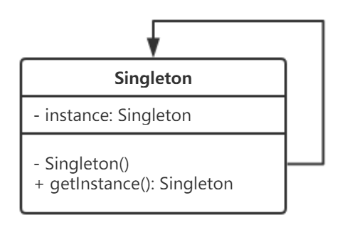

* [一、概述](#一概述)
* [二、UML 类图](#二UML-类图)
* [三、创建型](#三创建型)
    * [单例（Singleton）](#单例Singleton)
    * [简单工厂（Simple Factory）](#简单工厂Simple-Factory)


# 一、概述

### 什么是设计模式？

设计模式是指针对软件开发过程中重复发生的问题的解决办法。其中以被称为 Gang of Four（GoF）的 4 人整理出的 23 种设计模式最为有名。

### 设计模式能够解决软件开发中的所有问题吗？

不能，每个设计模式都是用于解决软件开发中遇到的问题的，但是无论使用什么解决方法，都需要从整体权衡。设计模式并不能解决所有问题。

### 如何选择合适的设计模式？

首先，必须明确知道自己的软件中存在什么样的问题。如果问题不够明确，是无法选择出合适的设计模式的。
在学习设计模式时，要注意该模式可以解决什么问题。

### 设计模式的重要性

设计模式的重要性在于，可以帮助大家很快掌握那些经验丰富的开发人员才具有的知识和经验。

### 设计模式很难背下来怎么办？

没有必要全部背下来，机械地背下这些设计模式没有任何意义，重要的是在自己脑海中理解设计模式是怎样解决问题的。

# 二、UML 类图

[看懂 UML 类图和时序图](https://design-patterns.readthedocs.io/zh_CN/latest/read_uml.html)

<div align="center">   </div><br>


# 三、创建型

## 单例（Singleton）

### 思想

保证一个类仅有一个实例，并提供一个访问它的全局访问点。

### 类图

Singleton 类称为单例类，该类的构造函数是 Private 的，这是为了禁止从 Singleton 类的外部调用构造函数，这就堵死了外界利用 new 创建此类的可能。通过 getInstance 方法获得本类实例的唯一全局访问点。

<div align="center">   </div><br>

### 实现

#### 1、饿汉式 - 线程安全 [可用]

当类被加载时，静态变量 instance 会被初始化，此时类的私有函数会被调用，单例类的唯一实例将被创建。

```java
class Singleton {   
    private static Singleton instance = new Singleton();   
    private Singleton() { }   

    public static Singleton getInstance() {  
        return instance;   
    }     
}
```

**优点：** 写法比较简单，在类装载的时候就完成实例化，避免了线程同步问题。

**缺点：** 在类装载的时候就完成实例化，没有达到 Lazy Loading 的效果。如果从始至终从未使用过这个实例，则会造成内存的浪费。

#### 2、懒汉式 - 线程不安全 [不可用]

这种写法起到了Lazy Loading的效果，但是只能在单线程下使用。

```java
public class Singleton {

    private static Singleton singleton;

    private Singleton() {}

    public static Singleton getInstance() {
        if (singleton == null) {
            singleton = new Singleton();
        }
        return singleton;
    }
}
```

#### 3、懒汉式 - 线程安全 同步方法 [不推荐]

虽然解决了线程不安全问题，但是效率很低，每个线程在想获得类的实例时候，执行getInstance()方法都要进行同步。

```java
public class Singleton {

    private static Singleton singleton;

    private Singleton() {}

    public static synchronized Singleton getInstance() {
        if (singleton == null) {
            singleton = new Singleton();
        }
        return singleton;
    }
}
```

#### 4、懒汉式 - 线程安全 同步代码块 [不可用]

由于上一种实现方式同步效率太低，所以摒弃同步方法，改为同步产生实例化的的代码块，但是这种同步并不能起到线程同步的作用。假如一个线程进入了 `if (singleton == null)` 判断语句块，还未来得及往下执行，另一个线程也通过了这个判断语句，这时便会产生多个实例。

```java
public class Singleton {

    private static Singleton singleton;

    private Singleton() {}

    public static Singleton getInstance() {
        if (singleton == null) {
            synchronized (Singleton.class) {
                singleton = new Singleton();
            }
        }
        return singleton;
    }
}
```

#### 5、双重校验锁（DCL） - 线程安全 [可用]

单例在第一次调用 `getInstance` 方法时实例化，在类加载时不自行实例化，即需要的时候再加载实例，为了处理多个线程同时访问的问题，加入双重锁机制。

```java
class LazySingleton {   
    private volatile static LazySingleton instance = null;   
    private LazySingleton() { }   

    public static LazySingleton getInstance() {   
        //第一重判断  
        if (instance == null) {  
            //锁定代码块  
            synchronized (LazySingleton.class) {  
                //第二重判断  
                if (instance == null) {  
                    instance = new LazySingleton(); //创建单例实例  
                }  
            }  
        }  
        return instance;   
    }  
}
```

#### 6、静态内部类 [推荐]

饿汉式单例类不能实现延迟加载，不管将来用不用始终占据内存；懒汉式单例类线程安全控制烦琐，而且性能受影响。

IoDH（Initialization Demand Holder） 技术能够克服单例的上述缺点，在单例类中增加一个静态内部类，在该内部类中创建单例对象，再将该单例对象通过 `getInstance` 方法返回给外部使用。

避免了线程不安全，延迟加载，效率高。

```java
class Singleton {  
    private Singleton() { }  

    private static class HolderClass {  
        private final static Singleton instance = new Singleton();  
    }  

    public static Singleton getInstance() {  
        return HolderClass.instance;  
    }  
}
```

#### 7、枚举 [推荐]

这种实现方式还没有被广泛采用，但这是实现单例模式的最佳方法。它更简洁，自动支持序列化机制，绝对防止多次实例化，防止反序列化重新创建新的对象。

```java
public enum Singleton {  
    INSTANCE;  
    public void whateverMethod() { }  
}
```
### 分析

#### 1、优点

系统内存中该类只存在一个对象，节省了系统资源，对于一些需要频繁创建销毁的对象，使用单例模式可以提高系统性能。

#### 2、缺点

当想实例化一个单例类的时候，必须要记住使用相应的获取对象的方法，而不是使用new，可能会给其他开发人员造成困扰，特别是看不到源码的时候。

#### 3、适用环境

* 需要频繁的进行创建和销毁的对象
* 创建对象时耗时过多或耗费资源过多，但又经常用到的对象
* 工具类对象
* 频繁访问数据库或文件的对象

#### 4、经验

一般情况下，不建议使用第 2、3、4 种懒汉方式，建议使用第 1 种饿汉方式。只有在要明确实现 Lazy Loading 效果时，才会使用第 6 种静态内部类。如果涉及到反序列化创建对象时，可以尝试使用第 7 种枚举方式。如果有其他特殊的需求，可以考虑使用第 5 种双重校验锁。

#### 5、应用

* **java.lang.Runtime#getRuntime()**

```java
public class Runtime {
    private static Runtime currentRuntime = new Runtime();

    public static Runtime getRuntime() {
        return currentRuntime;
    }

    private Runtime() {}
}
```
* **java.awt.Toolkit#getDefaultToolkit()** 

不需要事先创建好，只要在第一次真正用到的时候再创建就可以了，所以使用懒汉式[同步方法]。

* **java.awt.Desktop#getDesktop()**


## 简单工厂（Simple Factory）

### 思想

简单工厂模式，因为用于创建实例的方法是静态的，又称为静态工厂方法模式。在该模式中，可以根据参数的不同返回不同类的实例。简单工厂模式专门定义一个类来负责创建其他类的实例，被创建的实例通常都具有相同的父类。

### 结构

|         组成（角色）         |                   作用                   |
| :--------------------------: | :--------------------------------------: |
|       工厂（Factory）        | 根据传入不同参数从而创建具体产品类的实例 |
|     抽象产品（Product）      |            描述产品的公共接口            |
| 具体产品（Concrete Product） |            描述生产的具体产品            |

### 类图

<div align="center">   </div><br>

### 实现

#### 1、抽象产品类

```java
abstract class Product {
    //所有产品类的公共业务方法
    public void methodSame() {
        //公共方法的实现
    }

    //声明抽象业务方法
    public abstract void methodDiff();
}
```

#### 2、具体产品类

```java
class ConcreteProduct extends Product {
    //实现业务方法
    public void methodDiff() {
        //业务方法的实现
    }
}
```

#### 3、工厂类

```java
class Factory {
    //静态工厂方法
    public static Product getProduct(String arg) {
        Product product = null;
        if (arg.equalsIgnoreCase("A")) {
            product = new ConcreteProductA();
            //初始化设置product
        }
        else if (arg.equalsIgnoreCase("B")) {
            product = new ConcreteProductB();
            //初始化设置product
        }
        return product;
    }
}
```

#### 4、客户端类

```java
class Client {
    public static void main(String args[]) {
        Product product; 
        product = Factory.getProduct("A"); //通过工厂类创建产品对象
        product.methodSame();
        product.methodDiff();
    }
}
```

### 分析

#### 1、优点

* 工厂类含有必要的判断逻辑，可以决定在什么时候创建哪一个产品类的实例，客户端可以免除直接创建产品对象的责任，而仅仅“消费”产品；简单工厂模式通过这种做法实现了对责任的分割，它提供了专门的工厂类用于创建对象。
* 客户端无须知道所创建产品类的类名，只需要知道具体产品类对应的参数即可，对于一些复杂的类名，通过简单的工厂模式可以减少使用者的记忆量。
* 通过引入配置文件，可以在不修改任何客户端代码的情况下更换和增加新的具体产品类，在一定程度上提高了系统的灵活性。
* 当需要引入新的产品是不需要修改客户端的代码，只需要添加相应的产品类并修改工厂类就可以了，所以说从产品的角度上简单工厂模式是符合“开-闭”原则的。

#### 2、缺点

* 由于工厂类集中了所有产品创建逻辑，一旦不能正常工作，整个系统都要受到影响。
* 使用简单工厂模式将会增加系统中类的个数，在一定程序上增加了系统的复杂度和理解难度。
* 系统扩展困难，一旦添加新产品就不得不修改工厂逻辑，在产品类型较多时，有可能造成工厂逻辑过于复杂，不利于系统的扩展和维护。
* 简单工厂模式由于使用了静态工厂方法，造成工厂角色无法形成基于继承的等级结构。

#### 3、适用环境

* 工厂类负责创建的对象比较少：由于创建的对象较少，不会造成工厂方法中的业务逻辑太过复杂。
* 客户端只知道传入工厂类的参数，对于如何创建对象不关心：客户端既不需要关心创建细节，甚至连类名都不需要记住，只需要知道类型所对应的参数。

#### 4、应用

* **java.text.DateFormat** 

用于格式化一个本地日期或者时间。

```java
public final static DateFormat getDateInstance();
public final static DateFormat getDateInstance(int style);
public final static DateFormat getDateInstance(int style,Locale locale);
```

* **加密技术** 

获取不同加密算法的秘钥生成器

```java
KeyGenerator keyGen=KeyGenerator.getInstance("DESede");
```

  创建密码器

```java
Cipher cp=Cipher.getInstance("DESede");
```


## 参考内容

* [设计模式](https://gof.quanke.name/)
* [图说设计模式](https://design-patterns.readthedocs.io/zh_CN/latest/index.html)
* [Singleton Pattern](https://www.oodesign.com/)
* [设计模式 CyC2018](https://github.com/CyC2018/CS-Notes/blob/master/notes/设计模式.md)
* [UML 类图与类的关系详解](https://www.cnblogs.com/pangjianxin/p/7877868.html)
* [设计模式（三）——JDK中的那些单例](https://www.hollischuang.com/archives/1383)
* [单例模式的八种写法比较](https://www.cnblogs.com/zhaoyan001/p/6365064.html)
* [单例模式](http://www.runoob.com/design-pattern/singleton-pattern.html)
* [简单工厂模式（SimpleFactoryPattern）- 最易懂的设计模式解析](https://blog.csdn.net/carson_ho/article/details/52223153)
* [简单工厂模式](https://design-patterns.readthedocs.io/zh_CN/latest/creational_patterns/simple_factory.html)
* [工厂三兄弟之简单工厂模式（二）](http://wiki.jikexueyuan.com/project/design-pattern-creation/simple-two.html)
* [设计模式（一）简单工厂模式](https://blog.csdn.net/xingjiarong/article/details/49999121)